## Debounce

仅在过了一段指定的时间还没发送数据时才发送一个数据


`Debounce`操作符会过滤掉发送速率过快的数据项。

RxJava将这个操作符实现为`throttleWithTimeout`和`debounce`。

注意：这个操作符会会接着最后一项数据发送原始Observable的`onCompleted`通知，即使这个通知发生在你指定的时间窗口内（从最后一项数据的发送算起）。也就是说，`onCompleted`通知不会触发限流。

### throttleWithTimeout

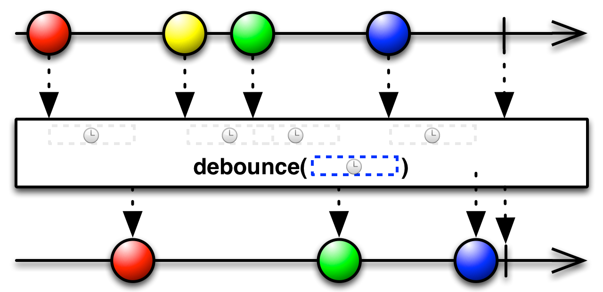

`throtleWithTimeout/debounce`的一个变体根据你指定的时间间隔进行限流，时间单位通过`TimeUnit`参数指定。

这种操作符默认在`computation`调度器上执行，但是你可以通过第三个参数指定。

* Javadoc: [throttleWithTimeout(long,TimeUnit)](http://reactivex.io/RxJava/javadoc/rx/Observable.html#throttleWithTimeout(long,%20java.util.concurrent.TimeUnit)) and [debounce(long,TimeUnit)](http://reactivex.io/RxJava/javadoc/rx/Observable.html#debounce(long,%20java.util.concurrent.TimeUnit))
* Javadoc: [throttleWithTimeout(long,TimeUnit,Scheduler)](http://reactivex.io/RxJava/javadoc/rx/Observable.html#throttleWithTimeout(long,%20java.util.concurrent.TimeUnit,%20rx.Scheduler)) and [debounce(long,TimeUnit,Scheduler)](http://reactivex.io/RxJava/javadoc/rx/Observable.html#debounce(long,%20java.util.concurrent.TimeUnit,%20rx.Scheduler))

### debounce

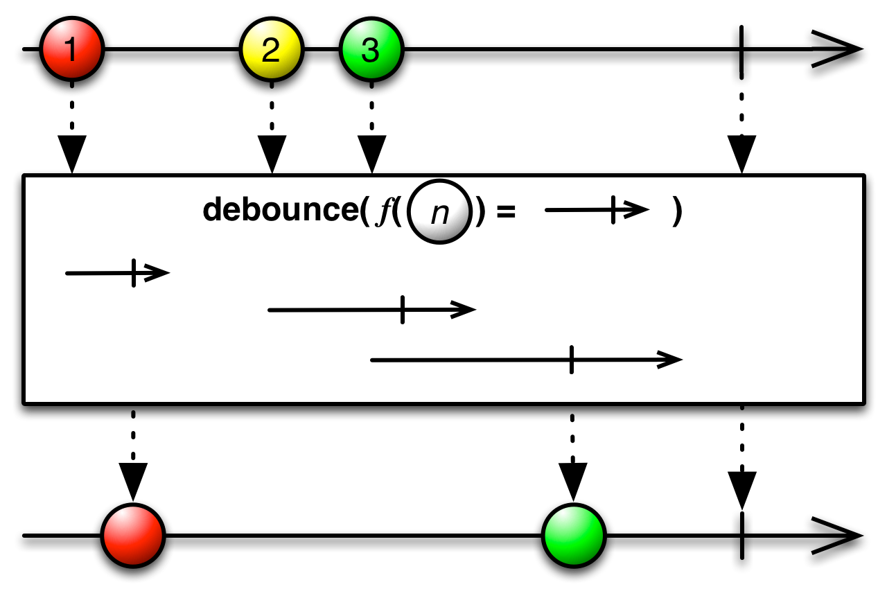

`debounce`操作符的一个变体通过对原始Observable的每一项应用一个函数进行限流，这个函数返回一个Observable。如果原始Observable在这个新生成的Observable结束之前发送了另一个数据，`debounce`会抑制(suppress)这个数据项。

`debounce`的这个变体默认不在任何特定的调度器上执行。


## Distinct

抑制（过滤掉）重复的数据项


`Distinct`的过滤规则是：只允许还没有发送过的数据项通过。

在某些实现中，有一些变体允许你调整判定两个数据不同(`distinct`)的标准。还有一些实现只比较一项数据和它的直接前驱，因此只会从序列中过滤掉连续重复的数据。

### distinct()

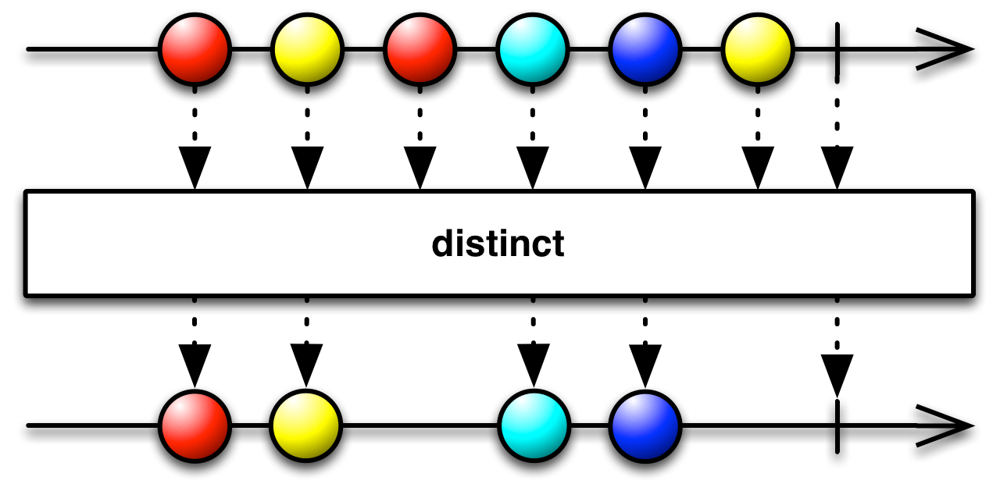

RxJava将这个操作符实现为`distinct`函数。

示例代码

```java

Observable.just(1, 2, 1, 1, 2, 3)
          .distinct()
          .subscribe(new Subscriber<Integer>() {
        @Override
        public void onNext(Integer item) {
            System.out.println("Next: " + item);
        }

        @Override
        public void onError(Throwable error) {
            System.err.println("Error: " + error.getMessage());
        }

        @Override
        public void onCompleted() {
            System.out.println("Sequence complete.");
        }
    });

```

输出

```
Next: 1
Next: 2
Next: 3
Sequence complete.
```

* Javadoc: [distinct()](http://reactivex.io/RxJava/javadoc/rx/Observable.html#distinct())

### distinct(Func1)


这个操作符有一个变体接受一个函数函数。这个函数根据原始Observable发送的数据项产生一个Key，然后，比较这些Key而不是数据本身，来判定两个数据是否是不同的。

* Javadoc: [distinct(Func1)](http://reactivex.io/RxJava/javadoc/rx/Observable.html#distinct(rx.functions.Func1))

### distinctUntilChanged

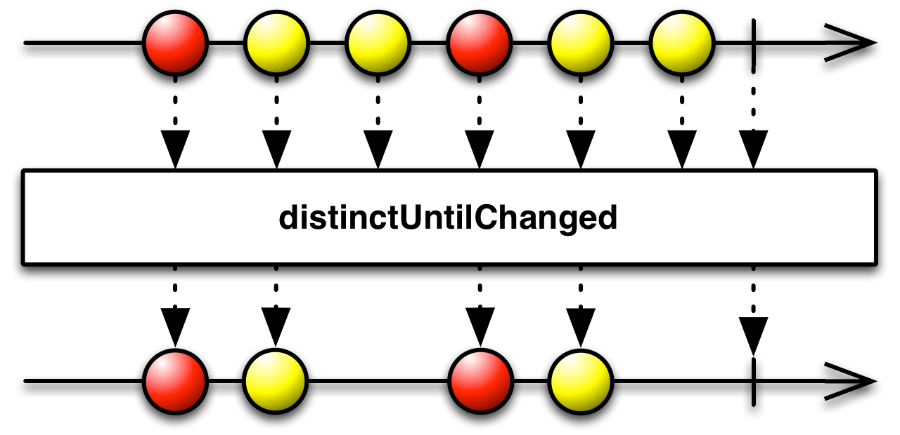

RxJava还是实现了一个`distinctUntilChanged`操作符。它只判定一个数据和它的直接前驱是否是不同的。

### distinctUntilChanged(Func1)

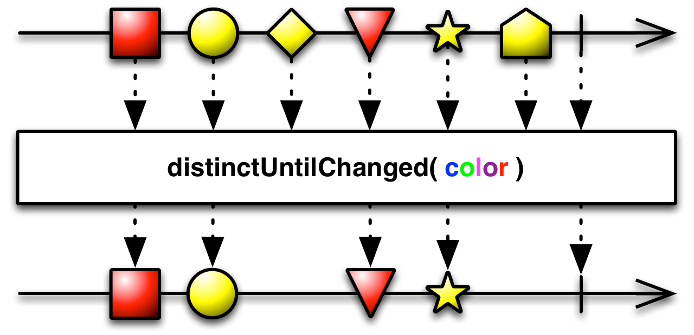

和`distinct(Func1)`一样，根据一个函数产生的Key判定两个相邻的数据项是不是不同的。

* Javadoc: [distinctUntilChanged(Func1)](http://reactivex.io/RxJava/javadoc/rx/Observable.html#distinctUntilChanged(rx.functions.Func1))

`distinct`和`distinctUntilChanged`默认不在任何特定的调度器上执行。


## ElementAt

只发送第N项数据


`ElementAt`操作符获取原始Observable发送的数据序列指定索引位置的数据项，然后当做自己的唯一数据发送。


RxJava将这个操作符实现为`elementAt`，给它传递一个基于0的索引值，它会发送原始Observable数据序列对应索引位置的值，如果你传递给`elementAt`的值为5，那么它会发送第六项的数据。

如果你传递的是一个负数，或者原始Observable的数据项数小于`index+1`，将会抛出一个`IndexOutOfBoundsException`异常。

* Javadoc: [elementAt(int)](http://reactivex.io/RxJava/javadoc/rx/Observable.html#elementAt(int))

### elementAtOrDefault


RxJava还实现了`elementAtOrDefault`操作符。与`elementAt`的区别是，如果索引值大于数据项数，它会发送一个默认值（通过额外的参数指定），而不是抛出异常。但是如果你传递一个负数索引值，它仍然会抛出一个`IndexOutOfBoundsException`异常。

* Javadoc: [elementAtOrDefault(int,T)](http://reactivex.io/RxJava/javadoc/rx/Observable.html#elementAtOrDefault(int,%20T))

`elementAt`和`elementAtOrDefault`默认不在任何特定的调度器上执行。


## Filter

只发送通过了谓词测试的数据项


`Filter`操作符使用你指定的一个谓词函数测试数据项，只有通过测试的数据才会被发送。


RxJava将这个操作符实现为`filter`函数。

示例代码

```java

Observable.just(1, 2, 3, 4, 5)
          .filter(new Func1<Integer, Boolean>() {
              @Override
              public Boolean call(Integer item) {
                return( item < 4 );
              }
          }).subscribe(new Subscriber<Integer>() {
        @Override
        public void onNext(Integer item) {
            System.out.println("Next: " + item);
        }

        @Override
        public void onError(Throwable error) {
            System.err.println("Error: " + error.getMessage());
        }

        @Override
        public void onCompleted() {
            System.out.println("Sequence complete.");
        }
    });

```

输出

```
Next: 1
Next: 2
Next: 3
Sequence complete.
```

`filter`默认不在任何特定的调度器上执行。

* Javadoc: [filter(Func1)](http://reactivex.io/RxJava/javadoc/rx/Observable.html#filter(rx.functions.Func1))

### ofType


`ofType`是`filter`操作符的一个特殊形式。它过滤一个Observable只返回指定类型的数据。

`ofType`默认不在任何特定的调度器上指定。

* Javadoc: [ofType(Class)](http://reactivex.io/RxJava/javadoc/rx/Observable.html#ofType(java.lang.Class))


## IgnoreElements

不发送任何数据，只反射Observable的结束通知

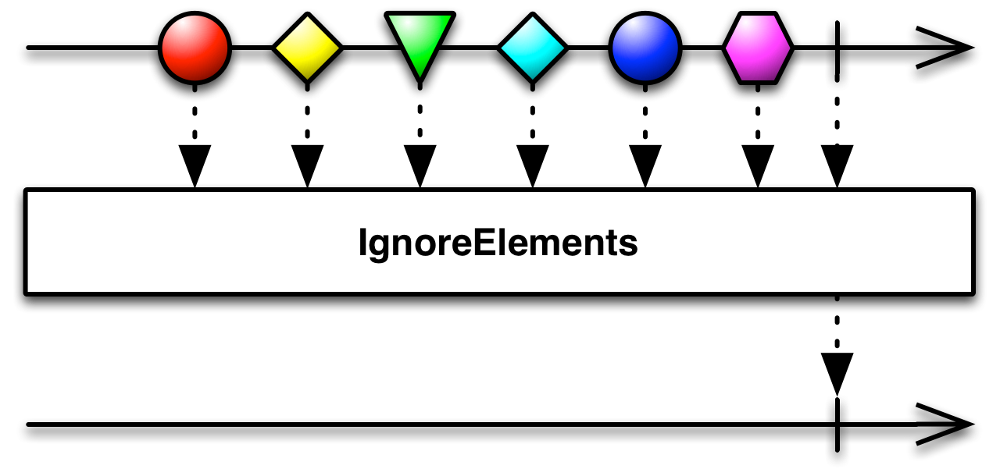

`IgnoreElements`操作符抑制原始Observable发送的所有数据，只允许它的结束通知（`onError`或`onCompleted`）通过。

如果你不关心一个Observable发送的数据，但是希望在它完成时或遇到错误结束时收到通知，你可以对Observable使用`ignoreElements`操作符，它会确保永远不会调用观察者的`onNext()`方法。

RxJava将这个操作符实现为`ignoreElements`。

* Javadoc: [ignoreElements()](http://reactivex.io/RxJava/javadoc/rx/Observable.html#ignoreElements())

`ignoreElements`默认不在任何特定的调度器上执行。


## First

只发送第一项（或者满足某个条件的第一项）数据

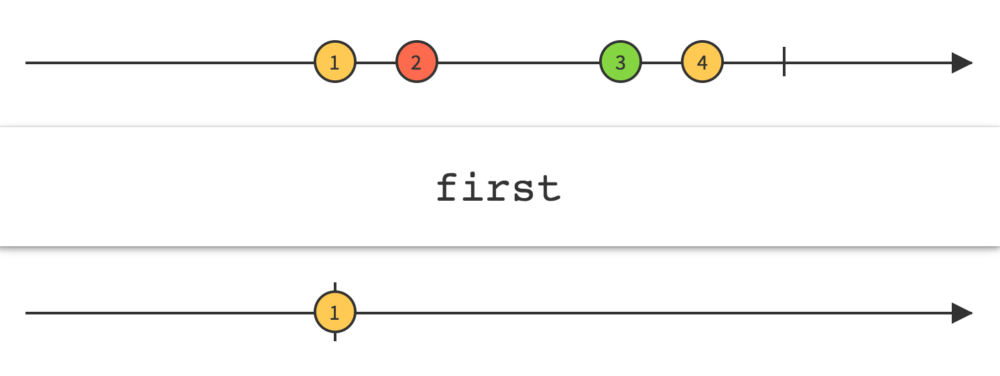

如果你只对Observable发送的第一项数据，或者满足某个条件的第一项数据感兴趣，你可以使用`First`操作符。

在某些实现中，`First`没有实现为一个返回Observable的过滤操作符，而是实现为一个在当时就发送原始Observable指定数据项的阻塞函数。在这些实现中，如果你想要的是一个过滤操作符，最好使用` Take(1)`或者`ElementAt(0)`。

在一些实现中还有一个`Single`操作符。它的行为与`First`类似，但为了确保只发送单个值，它会等待原始Observable结束（否则，不是发送那个值，而是以一个错误通知结束）。你可以使用它从原始Observable获取第一项数据，而且也确保只发送一项数据。

在RxJava中，这个操作符被实现为`first`，`firstOrDefault`和`takeFirst`。

可能容易混淆，`BlockingObservable`也有名叫`first`和`firstOrDefault`的操作符，它们会阻塞并返回值，不是立即返回一个Observable。

还有几个其它的操作符执行类似的功能。

### 过滤操作符


只发送第一个数据，使用没有参数的`first`操作符。

示例代码

```java
Observable.just(1, 2, 3)
          .first()
          .subscribe(new Subscriber<Integer>() {
        @Override
        public void onNext(Integer item) {
            System.out.println("Next: " + item);
        }

        @Override
        public void onError(Throwable error) {
            System.err.println("Error: " + error.getMessage());
        }

        @Override
        public void onCompleted() {
            System.out.println("Sequence complete.");
        }
    });
```

输出

```
Next: 1
Sequence complete.
```

* Javadoc: [first()](http://reactivex.io/RxJava/javadoc/rx/Observable.html#first())

### first(Func1)


传递一个谓词函数给`first`，然后发送这个函数判定为`true`的第一项数据。

* Javadoc: [first(Func1)](http://reactivex.io/RxJava/javadoc/rx/Observable.html#first(rx.functions.Func1))

### firstOrDefault

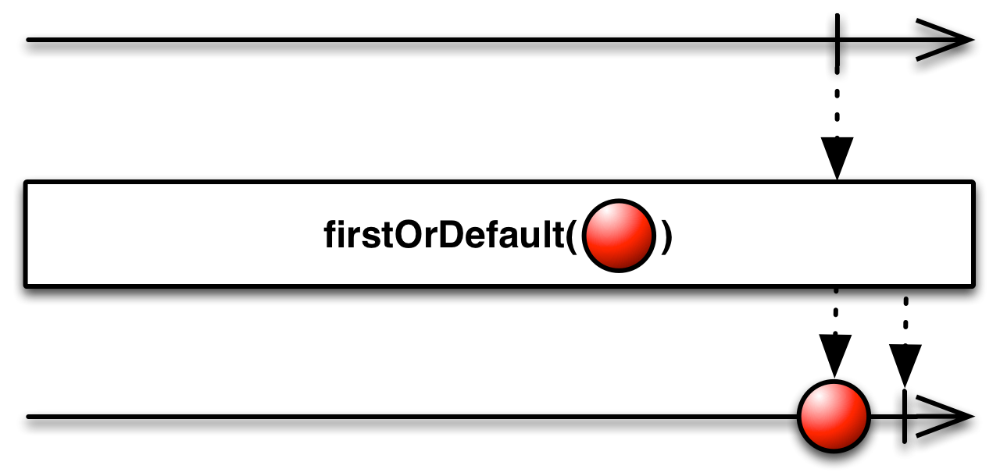

`firstOrDefault`与`first`类似，但是在Observagle没有发送任何数据时发送一个你在参数中指定的默认值。

* Javadoc: [firstOrDefault(T)](http://reactivex.io/RxJava/javadoc/rx/Observable.html#firstOrDefault(T))

### firstOrDefault(Func1)


传递一个谓词函数给`firstOrDefault `，然后发送这个函数判定为`true`的第一项数据，如果没有数据通过了谓词测试就发送一个默认值。

* Javadoc [firstOrDefault(T, Func1)](http://reactivex.io/RxJava/javadoc/rx/Observable.html#firstOrDefault(T, rx.functions.Func1))

### takeFirst


`takeFirst`与`first`类似，除了这一点：如果原始Observable没有发送任何满足条件的数据，`first`会抛出一个`NoSuchElementException`，`takeFist`会返回一个空的Observable（不调用`onNext()`但是会调用`onCompleted`）。

* Javadoc: [takeFirst(Func1)](http://reactivex.io/RxJava/javadoc/rx/Observable.html#takeFirst(rx.functions.Func1))

### single

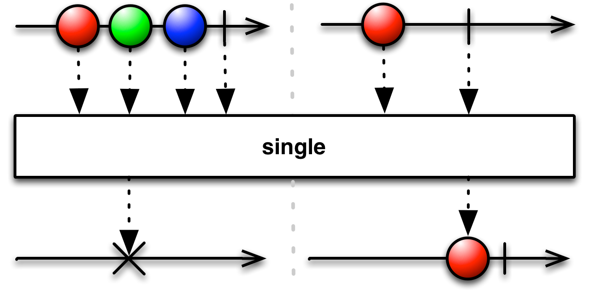

`single`操作符也与`first`类似，但是如果原始Observable在完成之前不是正好发送一次数据，它会抛出一个`NoSuchElementException`。

* Javadoc: [single()](http://reactivex.io/RxJava/javadoc/rx/Observable.html#single())

### single(Func1)


`single`的变体接受一个谓词函数，发送满足条件的单个值，如果不是正好只有一个数据项满足条件，会以错误通知结束。

* Javadoc: [single(Func1)](http://reactivex.io/RxJava/javadoc/rx/Observable.html#single(rx.functions.Func1))

### singleOrDefault


和`firstOrDefault`类似，但是如果原始Observable发送超过一个的数据，会以错误通知结束。

* Javadoc: [singleOrDefault(T)](http://reactivex.io/RxJava/javadoc/rx/Observable.html#singleOrDefault(T))

### singleOrDefault(T,Func1)

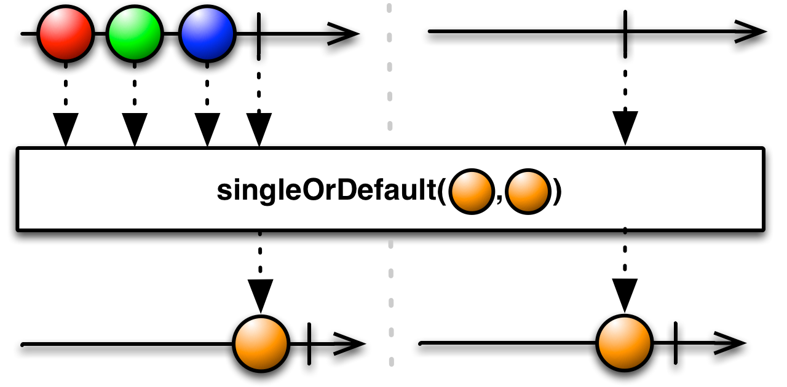

和`firstOrDefault(T, Func1)`类似，如果没有数据满足条件，返回默认值；如果有多个数据满足条件，以错误通知结束。

* Javadoc: [singleOrDefault(Func1,T)](http://reactivex.io/RxJava/javadoc/rx/Observable.html#singleOrDefault(rx.functions.Func1,%20T))

first系列的这几个操作符默认不在任何特定的调度器上执行。

## Last

只发送最后一项（或者满足某个条件的最后一项）数据


如果你只对Observable发送的最后一项数据，或者满足某个条件的最后一项数据感兴趣，你可以使用`Last`操作符。

在某些实现中，`Last `没有实现为一个返回Observable的过滤操作符，而是实现为一个在当时就发送原始Observable指定数据项的阻塞函数。在这些实现中，如果你想要的是一个过滤操作符，最好使用`TakeLast(1)`。

在RxJava中的实现是`last`和`lastOrDefault`。

可能容易混淆，`BlockingObservable`也有名叫`last `和`lastOrDefault `的操作符，它们会阻塞并返回值，不是立即返回一个Observable。

### 过滤操作符


只发送最后一项数据，使用没有参数的`last `操作符。

示例代码

```java
Observable.just(1, 2, 3)
          .last()
          .subscribe(new Subscriber<Integer>() {
        @Override
        public void onNext(Integer item) {
            System.out.println("Next: " + item);
        }

        @Override
        public void onError(Throwable error) {
            System.err.println("Error: " + error.getMessage());
        }

        @Override
        public void onCompleted() {
            System.out.println("Sequence complete.");
        }
    });
```

输出

```
Next: 3
Sequence complete.
```

* Javadoc: [last()](http://reactivex.io/RxJava/javadoc/rx/Observable.html#last())

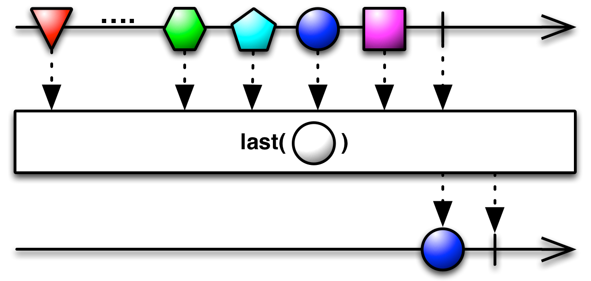

这个版本的`last`也是接受一个谓词函数，返回一个发送原始Observable中满足条件的最后一项数据的Observable。

* Javadoc: [last(Func1)](http://reactivex.io/RxJava/javadoc/rx/Observable.html#last(rx.functions.Func1))


`lastOrDefault`与`last`类似，不同的是，如果原始Observable没有发送任何值，它发送你指定的默认值。

* Javadoc: [lastOrDefault(T)](http://reactivex.io/RxJava/javadoc/rx/Observable.html#lastOrDefault(T))


这个版本的`lastOrDefault`可以接受一个谓词函数，如果有数据满足条件，返回的Observable就发送原始Observable满足条件的最后一项数据，否则发送默认值。

* Javadoc: [lastOrDefault(T)](http://reactivex.io/RxJava/javadoc/rx/Observable.html#lastOrDefault(T))

`last`和`lastOrDefault`默认不在任何特定的调度器上执行。


## Sample

定期发送Observable最近发送的数据项

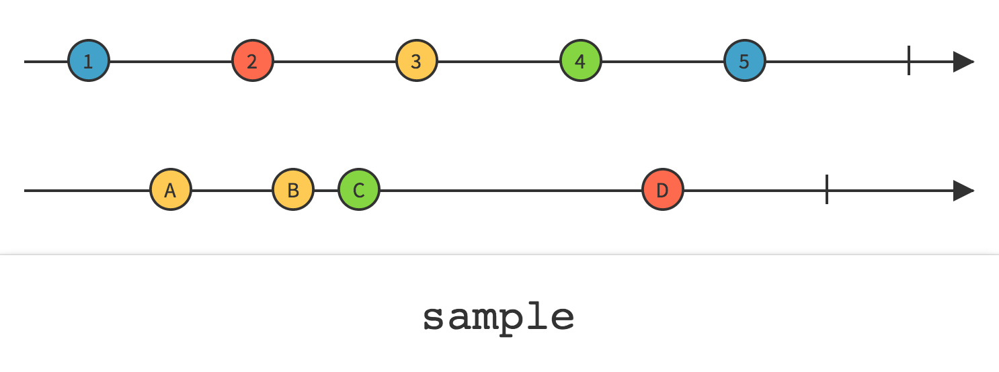

`Sample`操作符定时查看一个Observable，然后发送自上次采样以来它最近发送的数据。

在某些实现中，有一个`ThrottleFirst`操作符的功能类似，但不是发送采样期间的最近的数据，而是发送在那段时间内的第一项数据。

RxJava将这个操作符实现为`sample`和`throttleLast`。

注意：如果自上次采样以来，原始Observable没有发送任何数据，这个操作返回的Observable在那段时间内也不会发送任何数据。


`sample`(别名`throttleLast`)的一个变体按照你参数中指定的时间间隔定时采样（`TimeUnit`指定时间单位）。

`sample`的这个变体默认在`computation`调度器上执行，但是你可以使用第三个参数指定其它的调度器。

* Javadoc: [sample(long,TimeUnit)](http://reactivex.io/RxJava/javadoc/rx/Observable.html#sample(long,%20java.util.concurrent.TimeUnit))和[throttleLast(long,TimeUnit)](http://reactivex.io/RxJava/javadoc/rx/Observable.html#throttleLast(long,%20java.util.concurrent.TimeUnit))
* Javadoc: [sample(long,TimeUnit,Scheduler)](http://reactivex.io/RxJava/javadoc/rx/Observable.html#sample(long,%20java.util.concurrent.TimeUnit,%20rx.Scheduler))和[throttleLast(long,TimeUnit,Scheduler)](http://reactivex.io/RxJava/javadoc/rx/Observable.html#throttleLast(long,%20java.util.concurrent.TimeUnit,%20rx.Scheduler))

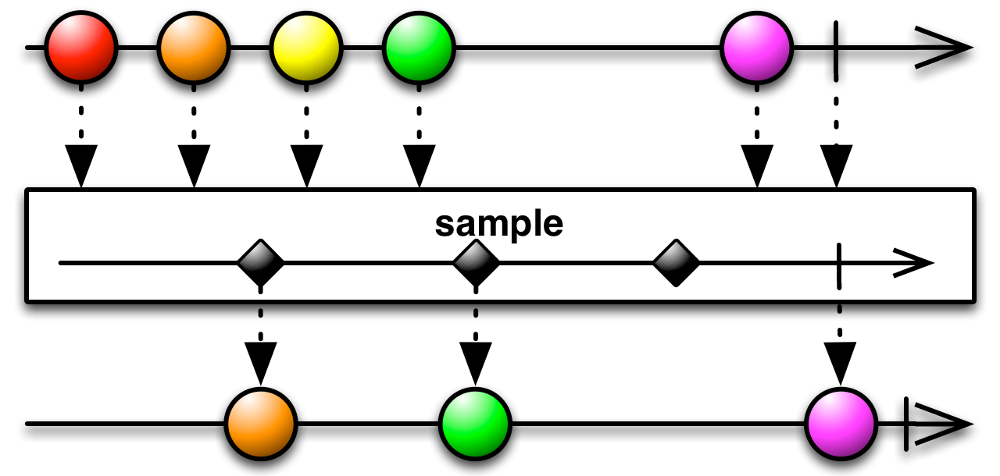

`sample`的这个变体每当第二个Observable发送一个数据（或者当它结束）时就对原始Observable进行采样。第二个Observable通过参数传递给`sample`。

`sample`的这个变体默认不在任何特定的调度器上执行。

* Javadoc: [sample(Observable)](http://reactivex.io/RxJava/javadoc/rx/Observable.html#sample(rx.Observable))

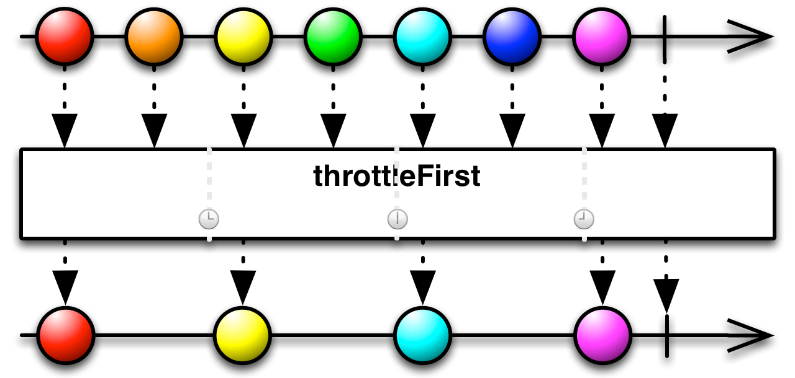

`throttleFirst`与`throttleLast/sample`不同，在每个采样周期内，它总是发送原始Observable的第一项数据，而不是最近的一项。

`throttleFirst`操作符默认在`computation`调度器上执行，但是你可以使用第三个参数指定其它的调度器。

* Javadoc: [throttleFirst(long,TimeUnit)](http://reactivex.io/RxJava/javadoc/rx/Observable.html#throttleFirst(long,%20java.util.concurrent.TimeUnit))
* Javadoc: [throttleFirst(long,TimeUnit,Scheduler)](http://reactivex.io/RxJava/javadoc/rx/Observable.html#throttleFirst(long,%20java.util.concurrent.TimeUnit,%20rx.Scheduler))


## Skip

抑制Observable发送的前N项数据


使用`Skip`操作符，你可以忽略Observable'发送的前N项数据，只保留之后的数据。

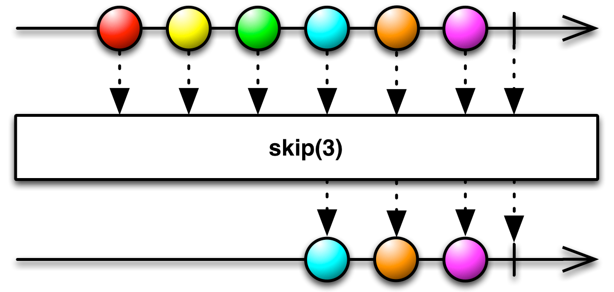

RxJava中这个操作符叫`skip`。`skip`的这个变体默认不在任何特定的调度器上执行。

* Javadoc: [skip(int)](http://reactivex.io/RxJava/javadoc/rx/Observable.html#skip(int))

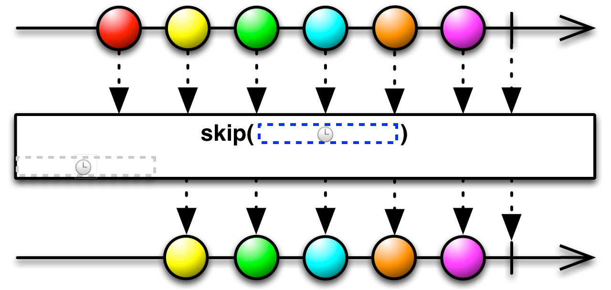

`skip`的这个变体接受一个时长而不是数量参数。它会丢弃原始Observable开始的那段时间发送的数据，时长和时间单位通过参数指定。

`skip`的这个变体默认在`computation`调度器上执行，但是你可以使用第三个参数指定其它的调度器。

* Javadoc: [skip(long,TimeUnit)](http://reactivex.io/RxJava/javadoc/rx/Observable.html#skip(long,%20java.util.concurrent.TimeUnit))
* Javadoc: [skip(long,TimeUnit,Scheduler)](http://reactivex.io/RxJava/javadoc/rx/Observable.html#skip(long,%20java.util.concurrent.TimeUnit,%20rx.Scheduler))


## SkipLast

抑制Observable发送的后N项数据

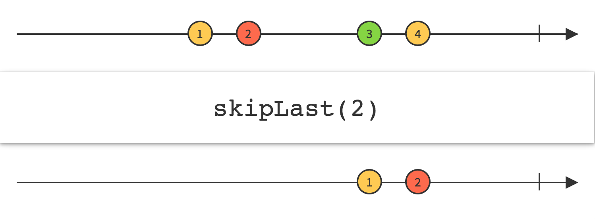

使用`Skip`操作符修改原始Observable，你可以忽略Observable'发送的后N项数据，只保留前面的数据。

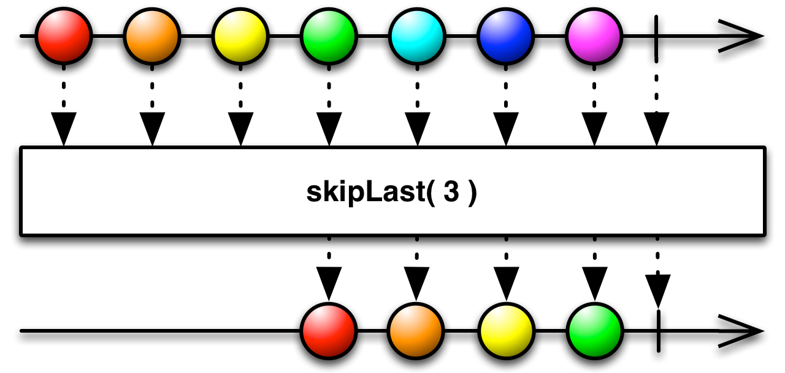

使用`SkipLast`操作符，你可以忽略原始Observable发送的后N项数据，只保留之前的数据。注意：这个机制是这样实现的：延迟原始Observable发送的任何数据项，直到它发送了N项数据。

`skipLast`的这个变体默认不在任何特定的调度器上执行。

* Javadoc: [skipLast(int)](http://reactivex.io/RxJava/javadoc/rx/Observable.html#skipLast(int))

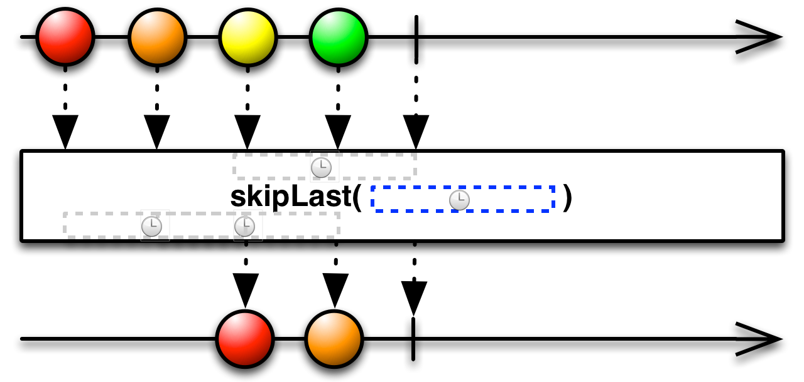

还有一个`skipLast`变体接受一个市场而不是数量参数。它会丢弃在原始Observable的生命周期内最后一段时间内发送的数据。时长和时间单位通过参数指定。

注意：这个机制是这样是西安的：延迟原始Observable发送的任何数据项，直到自这次发送之后过了给定的时长。

`skipLast `的这个变体默认在`computation`调度器上执行，但是你可以使用第三个参数指定其它的调度器。

* Javadoc: [skipLast(long,TimeUnit)](http://reactivex.io/RxJava/javadoc/rx/Observable.html#skipLast(long,%20java.util.concurrent.TimeUnit))
* Javadoc: [skipLast(long,TimeUnit,Scheduler)](http://reactivex.io/RxJava/javadoc/rx/Observable.html#skipLast(long,%20java.util.concurrent.TimeUnit,%20rx.Scheduler))


## Take


