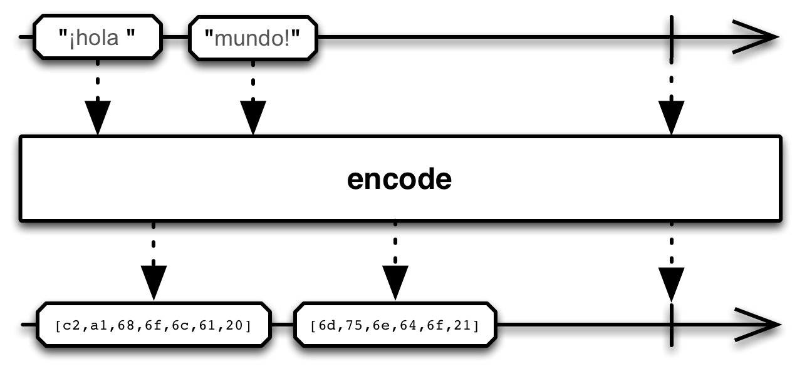
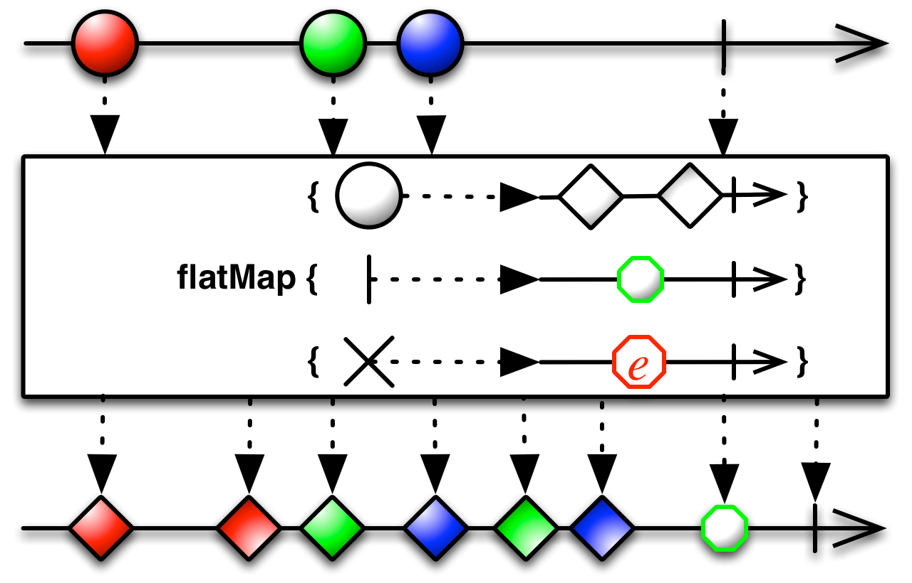
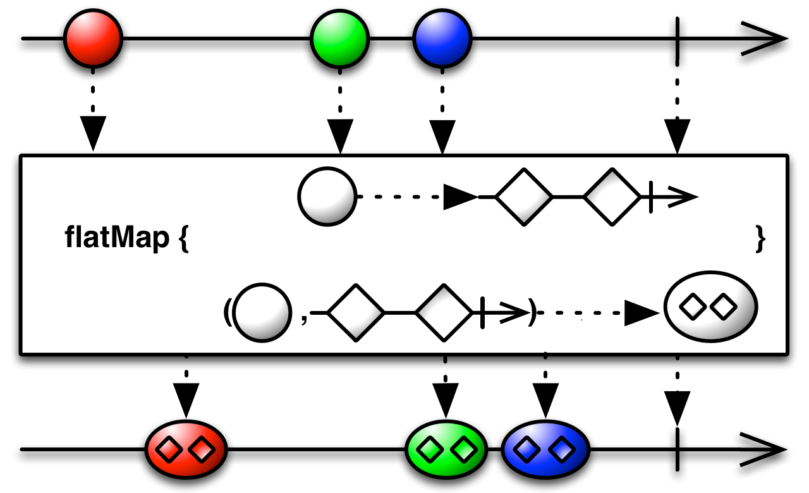
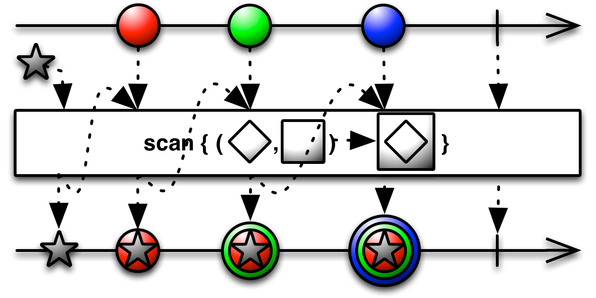
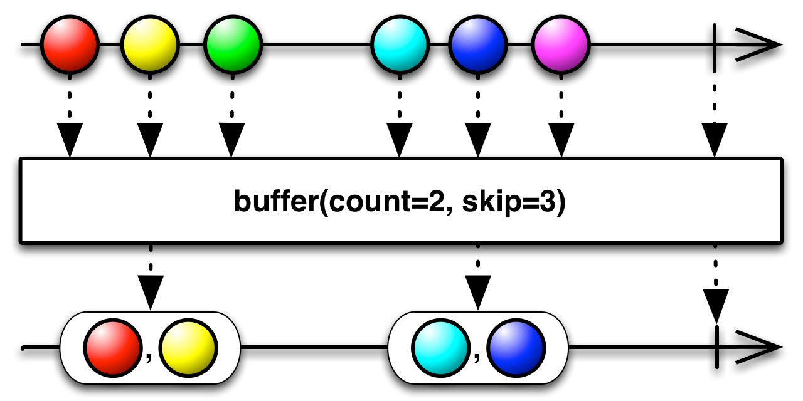
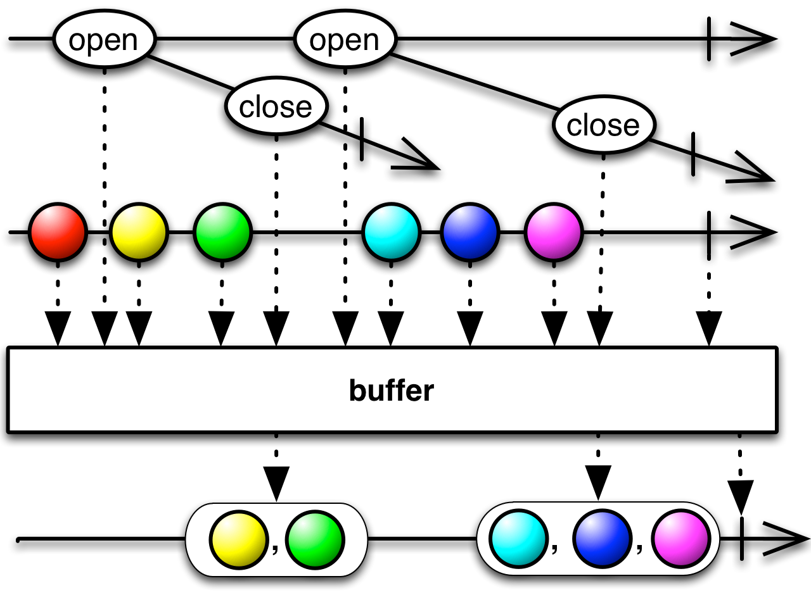
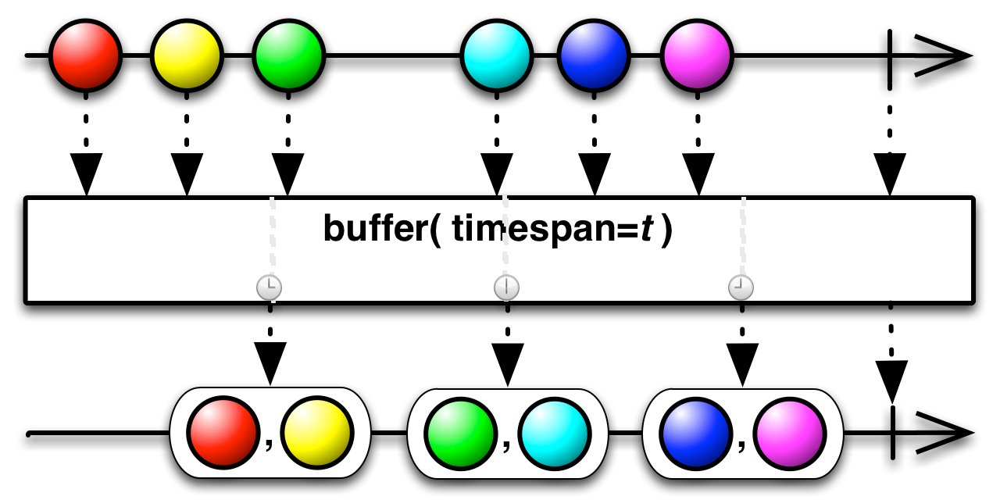
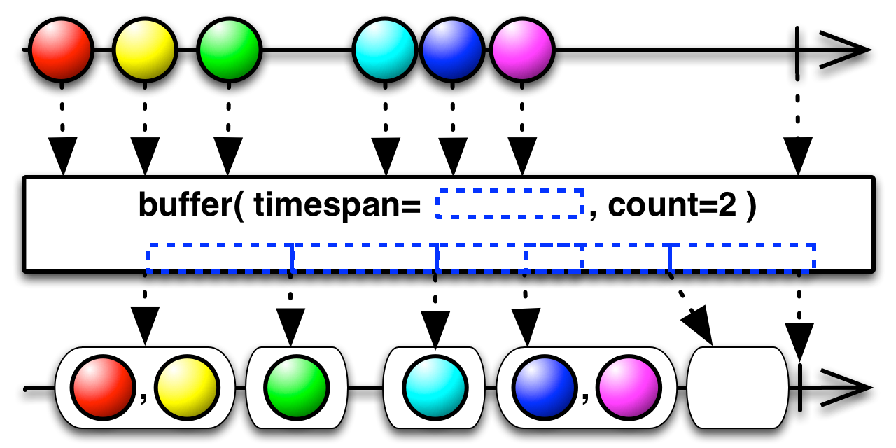
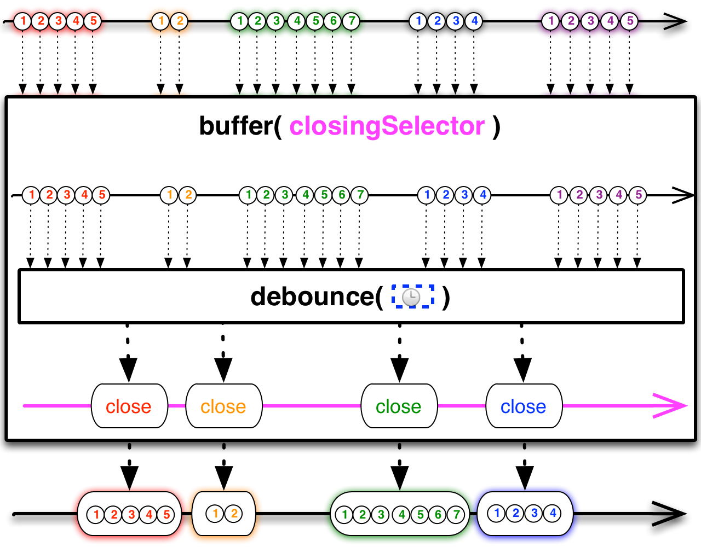

# 变换操作

## Map

对Observable发送的每一项数据应用一个函数，执行变换操作


`Map`操作符对原来Observable发送的每一项数据应用一个你选择的函数，然后返回一个发送这些结果的Observable。

RxJava将这个操作符实现为`map`函数。这个操作符默认不在任何特定的调度器上执行。

* Javadoc: [map(Func1)](http://reactivex.io/RxJava/javadoc/rx/Observable.html#map(rx.functions.Func1))

### cast


`cast`操作符将原来Observable发送的每一项数据都强制转换为一个指定的类型，然后再发送数据，它是`map`的一个特殊版本。

* Javadoc: [cast(Class)](http://reactivex.io/RxJava/javadoc/rx/Observable.html#cast(java.lang.Class))

### encode



`encode`在`StringObservable`类中，不是标准RxJava的一部分，它也是一个特殊的`map`操作符。`encode`将一个发送字符串的Observable变换为一个发送字节数组（这个字节数组按照原始字符串中的多字节字符边界划分）的Observable。

### byLine


`byLine `同样在`StringObservable`类中，也不是标准RxJava的一部分，它也是一个特殊的`map`操作符。`byLine`将一个发送字符串的Observable变换为一个按行发送来自原Observable的字符串的Observable。


## FlatMap

`FlatMap`将一个发送数据的Observable变换为多个Observables，然后将它们发送的数据合并后放进一个单独的Observable


`FlatMap`操作符使用一个指定的函数对原Observable发送的每一项数据执行变换操作，这个函数返回一个本身也发送数据的Observable，然后`FlatMap`合并这些Observables发送的数据并，最后将合并后的结果当做它自己的数据序列发送。

这个方法是很有用的，例如，当你有一个这样的Observable：它发送一个数据序列，这些数据本身包含Observable成员或者可以变换为Observable，因此你可以创建一个新的Observable发送这些次级Observable发送的数据的完整集合。

注意：`FlatMap`合并这些Observables发送的数据，因此它们可能是交错的。

在许多语言特定的实现中，还有一个操作符不会让变换后的Observables发送的数据交错，它按照严格的顺序发送这些数据，这个操作符通常被叫作`ConcatMap`或者类似的名字。


RxJava将这个操作符实现为`flatMap`函数。

注意：如果任何一个通过这个`flatMap`操作产生的单独的Observable调用`onError`异常终止了，这个Observable自身会立即调用`onError`并终止。

这个操作符有一个接受额外的`int`参数的一个变体。这个参数设置`flatMap`从原来的Observable映射Observables的最大同时订阅数。当达到这个限制时，它会等待其中一个结束然后再订阅另一个。

* Javadoc: [flatMap(Func1)](http://reactivex.io/RxJava/javadoc/rx/Observable.html#flatMap(rx.functions.Func1))
* Javadoc: [flatMap(Func1,int)(http://reactivex.io/RxJava/javadoc/rx/Observable.html#flatMap(rx.functions.Func1,%20int))



还有一个版本的`flatMap`为原始Observable的每一项数据和每一个通知创建一个新的Observable（并对数据平坦化）。

它也有一个接受额外`int`参数的变体。

* Javadoc: [flatMap(Func1,Func1,Func0)](http://reactivex.io/RxJava/javadoc/rx/Observable.html#flatMap(rx.functions.Func1,%20rx.functions.Func1,%20rx.functions.Func0))
* Javadoc: [flatMap(Func1,Func1,Func0,int)](http://reactivex.io/RxJava/javadoc/rx/Observable.html#flatMap(rx.functions.Func1,%20rx.functions.Func1,%20rx.functions.Func0,%20int))



还有一个版本的`flatMap`会使用原始Observable的数据触发的Observable组合这些数据，然后发送这些数据组合。它也有一个接受额外`int`参数的版本。

* Javadoc: [flatMap(Func1,Func2)](http://reactivex.io/RxJava/javadoc/rx/Observable.html#flatMap(rx.functions.Func1,%20rx.functions.Func2))
* Javadoc: [flatMap(Func1,Func2,int)](http://reactivex.io/RxJava/javadoc/rx/Observable.html#flatMap(rx.functions.Func1,%20rx.functions.Func2,%20int))

### flatMapIterable


`flatMapIterable`这个变体成对的打包数据，然后生成Iterable而不是原始数据和生成的Observables，但是处理方式是相同的。

* Javadoc: [flatMapIterable(Func1)](http://reactivex.io/RxJava/javadoc/rx/Observable.html#flatMapIterable(rx.functions.Func1))
* Javadoc: [flatMapIterable(Func1,Func2)](http://reactivex.io/RxJava/javadoc/rx/Observable.html#flatMapIterable(rx.functions.Func1,%20rx.functions.Func2))

### concatMap


还有一个`concatMap`操作符，它类似于最简单版本的`flatMap`，但是它按次序连接而不是合并那些生成的Observables，然后产生自己的数据序列。

* Javadoc: [concatMap(Func1)](http://reactivex.io/RxJava/javadoc/rx/Observable.html#concatMap(rx.functions.Func1))

### switchMap


RxJava还实现了`switchMap`操作符。它和`flatMap`很像，除了一点：当原始Observable发送一个新的数据（Observable）时，它将取消订阅并停止监视产生执之前那个数据的Observable，只监视当前这一个。

* Javadoc: [switchMap(Func1)](http://reactivex.io/RxJava/javadoc/rx/Observable.html#switchMap(rx.functions.Func1))

### split


在特殊的`StringObservable`类（默认没有包含在RxJava中）中还有一个`split`操作符。它将一个发送字符串的Observable转换为另一个发送字符串的Observable，只不过，后者将原始的数据序列当做一个数据流，使用一个正则表达式边界分割它们，然后合并发送分割的结果。


## GroupBy

将一个Observable分拆为一些Observables集合，它们中的每一个发送原始Observable的一个子序列


`GroupBy`操作符将原始Observable分拆为一些Observables集合，它们中的每一个发送原始Observable数据序列的一个子序列。哪个数据项由哪一个Observable发送是由一个函数判定的，这个函数给每一项指定一个Key，Key相同的数据会被同一个Observable发送。

RxJava实现了`groupBy`操作符。它返回Observable的一个特殊子类`GroupedObservable`，实现了`GroupedObservable`接口的对象有一个额外的方法`getKey`，这个Key用于将数据分组到指定的Observable。

有一个版本的`groupBy`允许你传递一个变换函数，这样它可以在发送结果`GroupedObservable`之前改变数据项。

注意：`groupBy`将原始Observable分解为一个发送多个`GroupedObservable`的Observable，一旦有订阅，每个`GroupedObservable`就开始缓存数据。因此，如果你忽略这些`GroupedObservable`中的任何一个，这个缓存可能形成一个潜在的内存泄露。因此，如果你不想观察，也不要忽略`GroupedObservable`。你应该使用像`take(0)`这样会丢弃自己的缓存的操作符。

如果你取消订阅一个`GroupedObservable`，那个Observable将会结束。如果之后原始的Observable又发送了一个与这个Observable的Key匹配的数据，`groupBy`将会为这个Key创建一个新的`GroupedObservable`。

`groupBy`默认不在任何特定的调度器上执行。

* Javadoc: [groupBy(Func1)](http://reactivex.io/RxJava/javadoc/rx/Observable.html#groupBy(rx.functions.Func1))
* Javadoc: [groupBy(Func1,Func1)](http://reactivex.io/RxJava/javadoc/rx/Observable.html#groupBy(rx.functions.Func1,%20rx.functions.Func1))


## Scan

连续地对数据序列的每一项应用一个函数，然后连续发送结果


`Scan`操作符对原始Observable发送的第一项数据应用一个函数，然后将那个函数的结果作为自己的第一项数据发送。它将函数的结果同第二项数据一起填充给这个函数来产生它自己的第二项数据。它持续进行这个过程来产生剩余的数据序列。这个操作符在某些情况下被叫做`accumulator`。


RxJava实现了`scan`操作符。

示例代码：

```java

Observable.just(1, 2, 3, 4, 5)
    .scan(new Func2<Integer, Integer, Integer>() {
        @Override
        public Integer call(Integer sum, Integer item) {
            return sum + item;
        }
    }).subscribe(new Subscriber<Integer>() {
        @Override
        public void onNext(Integer item) {
            System.out.println("Next: " + item);
        }

        @Override
        public void onError(Throwable error) {
            System.err.println("Error: " + error.getMessage());
        }

        @Override
        public void onCompleted() {
            System.out.println("Sequence complete.");
        }
    });

```

输出

```
Next: 1
Next: 3
Next: 6
Next: 10
Next: 15
Sequence complete.
```

* Javadoc: [scan(Func2)](http://reactivex.io/RxJava/javadoc/rx/Observable.html#scan(rx.functions.Func2))



有一个`scan`操作符的变体，你可以传递一个种子值给累加器函数的第一次调用（Observable发送的第一项数据）。如果你使用这个版本，`scan`将发送种子值作为自己的第一项数据。注意：传递`null`作为种子值与不传递是不同的，`null`种子值是合法的。

* Javadoc: [scan(R,Func2)](http://reactivex.io/RxJava/javadoc/rx/Observable.html#scan(R,%20rx.functions.Func2))

这个操作符默认不在任何特定的调度器上执行。


## Buffer

定期收集来自一个Observable的数据放进一个数据包裹，然后发送这些数据包裹，而不是一次发送一个值。


`Buffer`操作符将一个Observable变换为另一个，原来的Observable正常发送数据，变换产生的Observable发送这些数据的缓存集合。`Buffer`操作符在很多语言特定的实现中有很多种变体，它们在如何缓存这个问题上存在区别。

注意：如果原来的Observable发送了一个`onError`通知，`Buffer`会立即传递这个通知，而不是首先发送缓存的数据，即使在这之前缓存中包含了原来Observable发送的数据。

`Window`操作符与`Buffer`类似，但是它在发送之前把收集到的数据放进单独的Observable，而不是放进一个数据结构。

在RxJava中有许多`Buffer`的变体：

### buffer(count)


`buffer(count)`以列表(List)的形式发送非重叠的缓存，每一个缓存至多包含来自原来Observable的count项数据（最后发送的列表数据可能少于count项）

* Javadoc: [buffer(int)](http://reactivex.io/RxJava/javadoc/rx/Observable.html#buffer(int))

### buffer(count, skip)



`buffer(count, skip)`从原来Observable的第一项数据开始创建新的缓存，此后每当收到`skip`项数据，用`count`项数据填充缓存：开头的一项和后续的`count-1`项，它以列表(List)的形式发送缓存，取决于`count`和`skip`的值，这些缓存可能会有重叠部分（比如skip<count时），也可能会有间隙（比如skip>count时）。

* Javadoc: [buffer(int,int)](http://reactivex.io/RxJava/javadoc/rx/Observable.html#buffer(int,%20int))

### buffer(bufferClosingSelector)


当它订阅原来的Observable时，`buffer(bufferClosingSelector)`开始将数据收集到一个`List`，然后它调用`bufferClosingSelector`生成第二个Observable，当第二个Observable发送一个`TClosing`时，`buffer`发送当前的`List`，然后重复这个过程：开始组装一个新的`List`，然后调用`bufferClosingSelector`创建一个新的Observable并监视它。它会一直这样做直到原来的Observable执行完成。

* Javadoc: [buffer(Func0)](http://reactivex.io/RxJava/javadoc/rx/Observable.html#buffer(rx.functions.Func0))

### buffer(boundary)


`buffer(boundary)`监视一个名叫`boundary`的Observable，每当这个Observable发送了一个值，它就创建一个新的`List`开始收集来自原来Observable的数据并发送原来的`List`。

* Javadoc: [buffer(Observable)](http://reactivex.io/RxJava/javadoc/rx/Observable.html#buffer(rx.Observable))
* Javadoc: [buffer(Observable,int)](http://reactivex.io/RxJava/javadoc/rx/Observable.html#buffer(rx.Observable,%20int))

### buffer(bufferOpenings, bufferClosingSelector)



`buffer(bufferOpenings, bufferClosingSelector)`监视这个叫`bufferOpenings`的Observable（它发送`BufferOpening`对象），每当`bufferOpenings`发送了一个数据时，它就创建一个新的`List`开始手机来自原来Observable的数据，并将`bufferOpenings`传递给`closingSelector`函数。这个函数返回一个Observable。`buffer`监视这个Observable，当它检测到一个来自这个Observable的数据时，就关闭`List`并且发送它自己的数据（之前的那个List）。

* Javadoc: [buffer(Observable,Func1)](http://reactivex.io/RxJava/javadoc/rx/Observable.html#buffer(rx.Observable,%20rx.functions.Func1))

### buffer(timespan, unit[, scheduler])



`buffer(timespan, unit)`定期以`List`的形式发送新的数据，每个时间段，收集来自原Observable的数据（从前面一个数据包裹之后，或者如果是第一个数据包裹，从有观察者订阅原来的Observale之后开始）。还有另一个版本的`buffer`接受一个`Scheduler`参数，默认情况下会使用`computation`调度器。

* Javadoc: [buffer(long,TimeUnit)](http://reactivex.io/RxJava/javadoc/rx/Observable.html#buffer(long,%20java.util.concurrent.TimeUnit))
* Javadoc: [buffer(long,TimeUnit,Scheduler)](http://reactivex.io/RxJava/javadoc/rx/Observable.html#buffer(long,%20java.util.concurrent.TimeUnit,%20rx.Scheduler))

### buffer(timespan, unit, count[, scheduler])



每当收到来自原来Observable的count项数据，或者每过了一段指定的时间后，`buffer(timespan, unit, count)`就以`List`的形式发送这期间的数据，即使数据项少于count项。还有另一个版本的`buffer`接受一个`Scheduler`参数，默认情况下会使用`computation`调度器。

* Javadoc: [buffer(long,TimeUnit,int)](http://reactivex.io/RxJava/javadoc/rx/Observable.html#buffer(long,%20java.util.concurrent.TimeUnit,%20int))
* Javadoc: [buffer(long,TimeUnit,int,Scheduler)](http://reactivex.io/RxJava/javadoc/rx/Observable.html#buffer(long,%20java.util.concurrent.TimeUnit,%20int,%20rx.Scheduler))

### buffer(timespan, timeshift, unit[, scheduler])


 
`buffer(timespan, timeshift, unit)`在每一个`timeshift`时期内都创建一个新的`List`,然后用原来Observable发送的每一项数据填充这个列表（在把这个`List`当做自己的数据发送前，从创建时开始，直到过了`timespan`这么长的时间）。如果`timespan`长于`timeshift`，它发送的数据包将会重叠，因此可能包含重复的数据项。

还有另一个版本的`buffer`接受一个`Scheduler`参数，默认情况下会使用`computation`调度器。

* Javadoc: [buffer(long,long,TimeUnit)](http://reactivex.io/RxJava/javadoc/rx/Observable.html#buffer(long,%20long,%20java.util.concurrent.TimeUnit))
* Javadoc: [buffer(long,long,TimeUnit,Scheduler)](http://reactivex.io/RxJava/javadoc/rx/Observable.html#buffer(long,%20long,%20java.util.concurrent.TimeUnit,%20rx.Scheduler))

### backpressure

你可以使用`Buffer`操作符实现反压`backpressure`（意思是，处理这样一个Observable：它产生数据的数据可能比它的观察者消费数据的数据快）。


Buffer操作符可以将大量的数据序列归纳(`reduce`)为较少的数据缓存序列，让它们更容易处理。例如，你可以按固定的时间间隔，定期关闭和发送来自一个爆发性Observable的数据缓存。相当于一个缓冲区。

示例代码

```java
Observable<List<Integer>> burstyBuffered = bursty.buffer(500, TimeUnit.MILLISECONDS);
```



或者，如果你想更进一步，可以在爆发期将数据收集到缓存，然后在爆发期结束时发送这些数据，使用 [`Debounce`](Filtering-Operators#Debounce) 操作符给`buffer`操作符发送一个缓存关闭指示器(`buffer closing indicator`)可以做到这一点。

代码示例：

```java

// we have to multicast the original bursty Observable so we can use it
// both as our source and as the source for our buffer closing selector:
Observable<Integer> burstyMulticast = bursty.publish().refCount();
// burstyDebounced will be our buffer closing selector:
Observable<Integer> burstyDebounced = burstyMulticast.debounce(10, TimeUnit.MILLISECONDS);
// and this, finally, is the Observable of buffers we're interested in:
Observable<List<Integer>> burstyBuffered = burstyMulticast.buffer(burstyDebounced);

```

### 参见

* [DebouncedBuffer With RxJava by Gopal Kaushik](http://nerds.weddingpartyapp.com/tech/2015/01/05/debouncedbuffer-used-in-rxbus-example/) 


## Window


