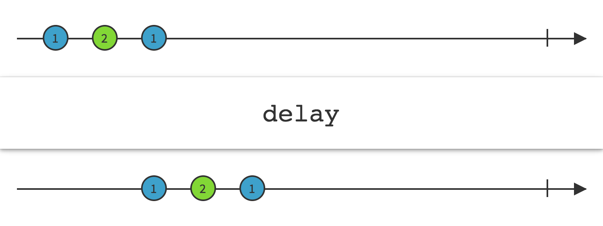
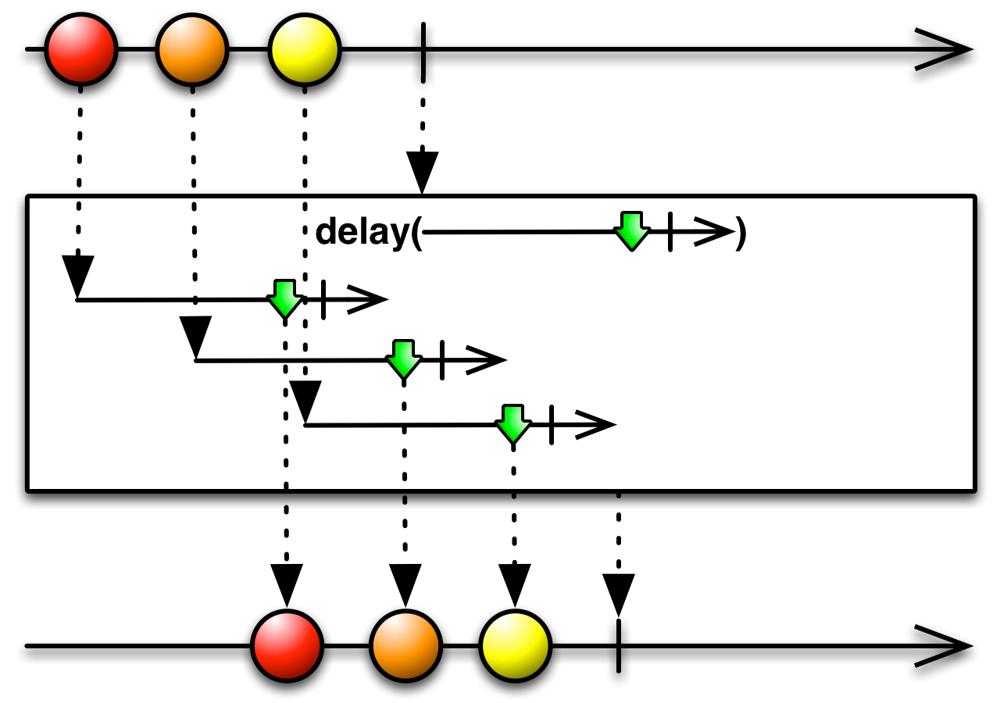
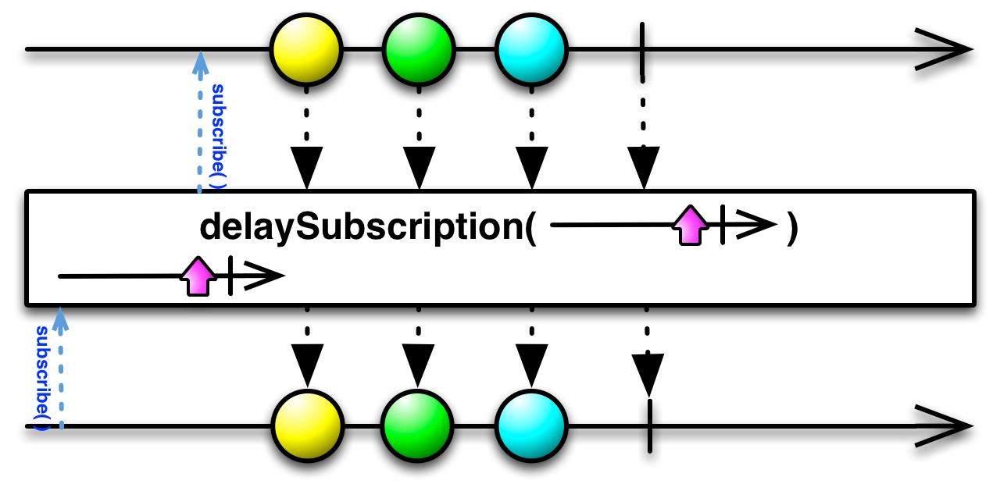

# Delay

延迟一段指定的时间再发射来自Observable的发射物

`Delay`操作符让原始Observable在发射每项数据之前都暂停一段指定的时间段。效果是Observable发射的数据项在时间上向前整体平移了一个增量。

RxJava的实现是 `delay`和`delaySubscription`。

第一种`delay`接受一个定义时长的参数（包括数量和单位）。每当原始Observable发射一项数据，`delay`就启动一个定时器，当定时器过了给定的时间段时，`delay`返回的Observable发射相同的数据项。

注意：`delay`不会平移`onError`通知，它会立即将这个通知传递给订阅者，同时丢弃任何待发射的`onNext`通知。然而它会平移一个`onCompleted`通知。

`delay`默认在`computation`调度器上执行，你可以通过参数指定使用其它的调度器。

* Javadoc: [delay(long,TimeUnit)](http://reactivex.io/RxJava/javadoc/rx/Observable.html#delay(long,%20java.util.concurrent.TimeUnit))
* Javadoc: [delay()](http://reactivex.io/RxJava/javadoc/rx/Observable.html#delay(long,%20java.util.concurrent.TimeUnit,%20rx.Scheduler))

另一种`delay`不实用常数延时参数，它使用一个函数针对原始Observable的每一项数据返回一个Observable，它监视返回的这个Observable，当任何那样的Observable终止时，`delay`返回的Observable就发射关联的那项数据。

这种`delay`默认不在任何特定的调度器上执行。

* Javadoc: [delay(Func1)](http://reactivex.io/RxJava/javadoc/rx/Observable.html#delay(rx.functions.Func1))

The variant of delay that uses a per-item Observable to set the `delay` has a variant that allows you to pass in a function that returns an Observable that acts as a delay timer for the subscription to the source Observable (in the absence of this, `delay` subscribes to the source Observable as soon as an observer subscribes to the Observable returned by `delay`).

这种`delay`默认不在任何特定的调度器上执行。

* Javadoc: [delay(Func0,Func1)](http://reactivex.io/RxJava/javadoc/rx/Observable.html#delay(rx.functions.Func0,%20rx.functions.Func1))

There is also an operator with which you can delay the subscription to the source Observable: `delaySubscription`. It accepts parameters that define the amount of time to delay (a quantity of time, and a TimeUnit that this quantity is denominated in).

`delaySubscription`默认在`computation`调度器上执行，你可以通过参数指定使用其它的调度器。

* Javadoc: [delaySubscription(long,TimeUnit)](http://reactivex.io/RxJava/javadoc/rx/Observable.html#delaySubscription(long,%20java.util.concurrent.TimeUnit))
* Javadoc: [delaySubscription(long,TimeUnit,Scheduler)](http://reactivex.io/RxJava/javadoc/rx/Observable.html#delaySubscription(long,%20java.util.concurrent.TimeUnit,%20rx.Scheduler))

And there is a variant of `delaySubscription` that uses an Observable (returned by a function you supply) rather than a fixed duration in order to set the subscription delay.

这种`delaySubscription `默认不在任何特定的调度器上执行。

* Javadoc: [delaySubscription(Func0)](http://reactivex.io/RxJava/javadoc/rx/Observable.html#delaySubscription(rx.functions.Func0))

