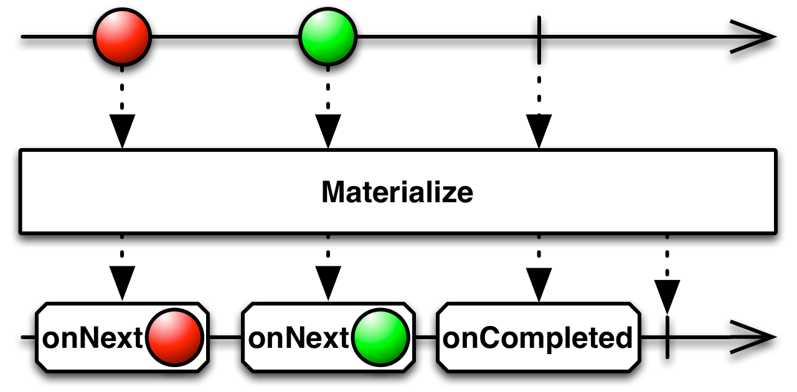
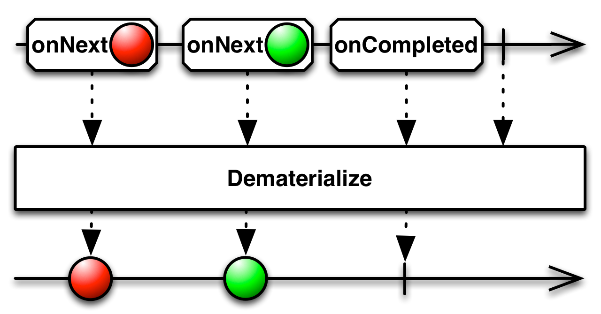

## Materialize/Dematerialize

`Materialize`将数据项和事件通知都当做数据项发射，`Dematerialize`刚好相反。

一个合法的有限的Obversable将调用它的观察者的`onNext`方法零次或多次，然后调用观察者的`onCompleted`或`onError`正好一次。`Materialize`操作符将这一系列调用，包括原来的`onNext`通知和终止通知`onCompleted`或`onError`都转换为一个Observable发射的数据序列。

RxJava的`materialize`将来自原始Observable的通知转换为`Notification`对象，然后它返回的Observable会发送这些数据。

`materialize`默认不在任何特定的调度器 ([`Scheduler`](Scheduler.md)) 上执行。

* Javadoc: [materialize()](http://reactivex.io/RxJava/javadoc/rx/Observable.html#materialize())

`Dematerialize`操作符是`Materialize`的逆向过程，它将`Materialize`转换的结果还原成它原本的形式。

`dematerialize`反转这个过程，将原始Observable发射的`Notification`对象还原成Observable的通知。

`dematerialize`默认不在任何特定的调度器 ([`Scheduler`](Scheduler.md)) 上执行。

* Javadoc: [dematerialize()](http://reactivex.io/RxJava/javadoc/rx/Observable.html#dematerialize())
