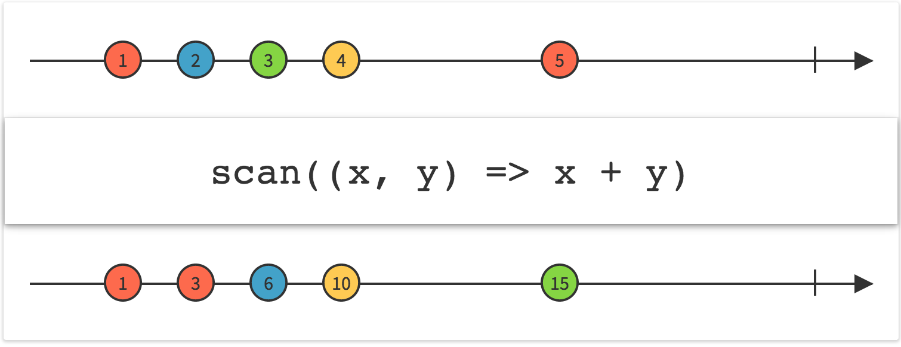

## Scan

连续地对数据序列的每一项应用一个函数，然后连续发送结果



`Scan`操作符对原始Observable发送的第一项数据应用一个函数，然后将那个函数的结果作为自己的第一项数据发送。它将函数的结果同第二项数据一起填充给这个函数来产生它自己的第二项数据。它持续进行这个过程来产生剩余的数据序列。这个操作符在某些情况下被叫做`accumulator`。


RxJava实现了`scan`操作符。

示例代码：

```java

Observable.just(1, 2, 3, 4, 5)
    .scan(new Func2<Integer, Integer, Integer>() {
        @Override
        public Integer call(Integer sum, Integer item) {
            return sum + item;
        }
    }).subscribe(new Subscriber<Integer>() {
        @Override
        public void onNext(Integer item) {
            System.out.println("Next: " + item);
        }

        @Override
        public void onError(Throwable error) {
            System.err.println("Error: " + error.getMessage());
        }

        @Override
        public void onCompleted() {
            System.out.println("Sequence complete.");
        }
    });

```

输出

```
Next: 1
Next: 3
Next: 6
Next: 10
Next: 15
Sequence complete.
```

* Javadoc: [scan(Func2)](http://reactivex.io/RxJava/javadoc/rx/Observable.html#scan(rx.functions.Func2))


有一个`scan`操作符的变体，你可以传递一个种子值给累加器函数的第一次调用（Observable发送的第一项数据）。如果你使用这个版本，`scan`将发送种子值作为自己的第一项数据。注意：传递`null`作为种子值与不传递是不同的，`null`种子值是合法的。

* Javadoc: [scan(R,Func2)](http://reactivex.io/RxJava/javadoc/rx/Observable.html#scan(R,%20rx.functions.Func2))

这个操作符默认不在任何特定的调度器上执行。
