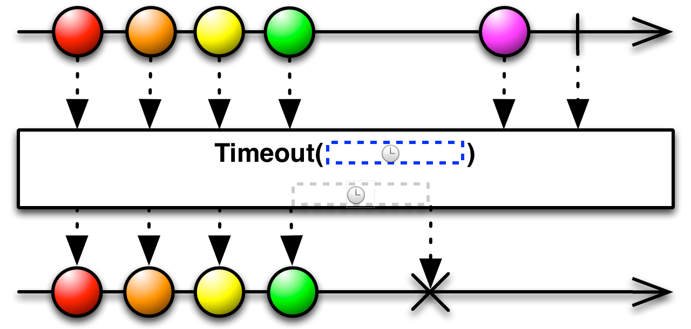
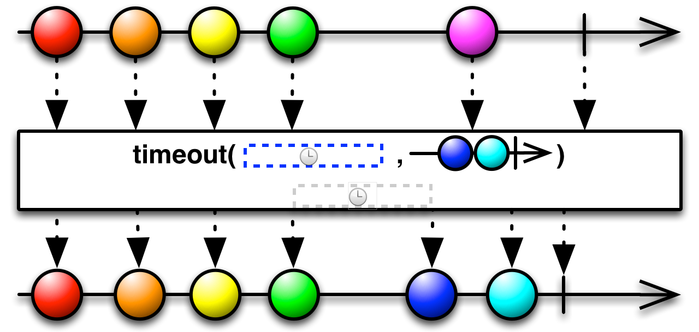
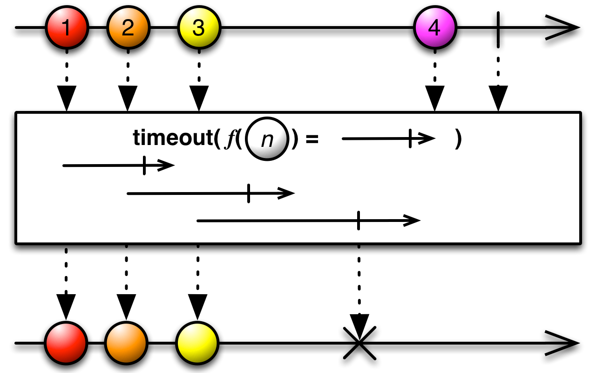
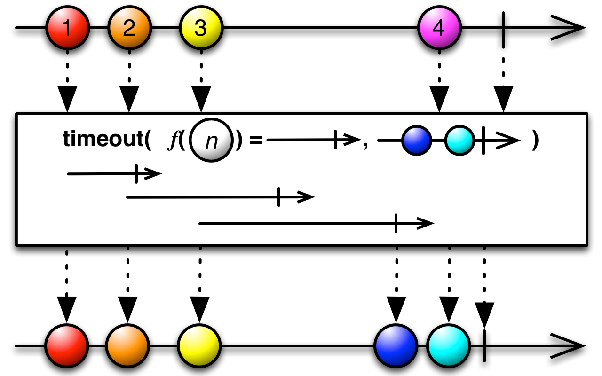
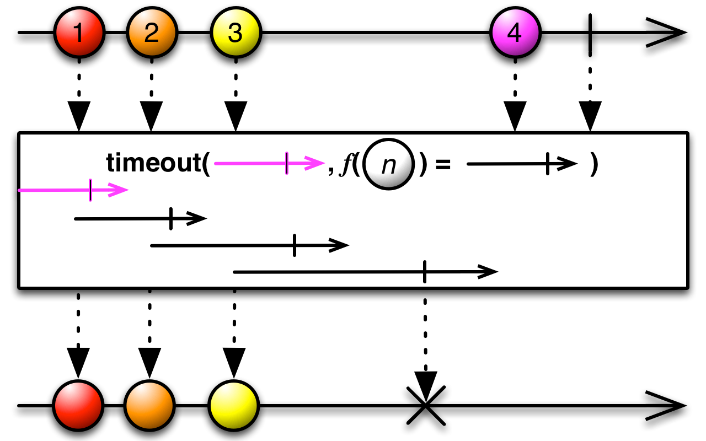
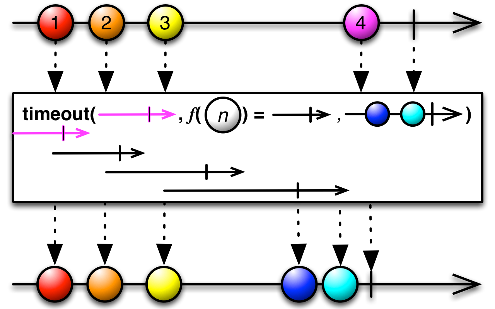

## Timeout

对原始Observable的一个镜像，如果过了一个指定的时长仍没有发射数据，它会发一个错误通知

如果原始Observable过了指定的一段时长没有发送任何数据，`Timeout`操作符会以一个`onError`通知终止这个Observable。

RxJava中的实现为`timeout`，但是有好几个变体。

第一个变体接受一个时长参数，每当原始Observable发射了一项数据，`timeout`就启动一个计时器，如果计时器超过了指定指定的时长而原始Observable没有发射另一项数据，`timeout`就抛出`TimeoutException`，以一个错误通知终止Observable。

这个`timeout`默认在`computation`调度器上执行，你可以通过参数指定其它的调度器。

* Javadoc: [timeout(long,TimeUnit)](http://reactivex.io/RxJava/javadoc/rx/Observable.html#timeout(long,%20java.util.concurrent.TimeUnit))
* Javadoc: [timeout()](http://reactivex.io/RxJava/javadoc/rx/Observable.html#timeout(long,%20java.util.concurrent.TimeUnit,%20rx.Scheduler))

这个版本的`timeout`在超时时会切换到使用一个你指定的备用的Observable，而不是发错误通知。它也默认在`computation`调度器上执行。

* Javadoc: [timeout(long,TimeUnit,Observable)](http://reactivex.io/RxJava/javadoc/rx/Observable.html#timeout(long,%20java.util.concurrent.TimeUnit,%20rx.Observable))
* Javadoc: [timeout(long,TimeUnit,Observable,Scheduler)](http://reactivex.io/RxJava/javadoc/rx/Observable.html#timeout(long,%20java.util.concurrent.TimeUnit,%20rx.Observable,%20rx.Scheduler))

这个版本的`timeout`使用一个函数针对原始Observable的每一项返回一个Observable，如果当这个Observable终止时原始Observable还没有发射另一项数据，就会认为是超时了，`timeout`就抛出`TimeoutException`，以一个错误通知终止Observable。

这个`timeout`默认在`immediate`调度器上执行。

* Javadoc: [timeout(Func1)](http://reactivex.io/RxJava/javadoc/rx/Observable.html#timeout(rx.functions.Func1))

这个版本的`timeout`同时指定超时时长和备用的Observable。它默认在`immediate`调度器上执行。

* Javadoc: [timeout(Func1,Observable)](http://reactivex.io/RxJava/javadoc/rx/Observable.html#timeout(rx.functions.Func1,%20rx.Observable))

这个版本的`time`除了给每一项设置超时，还可以单独给第一项设置一个超时。它默认在`immediate`调度器上执行。

* Javadoc: [timeout(Func0,Func1)](http://reactivex.io/RxJava/javadoc/rx/Observable.html#timeout(rx.functions.Func0,%20rx.functions.Func1))

同上，但是同时可以指定一个备用的Observable。它默认在`immediate`调度器上执行。

* Javadoc: [timeout(Func0,Func1,Observable)](http://reactivex.io/RxJava/javadoc/rx/Observable.html#timeout(rx.functions.Func0,%20rx.functions.Func1,%20rx.Observable))

