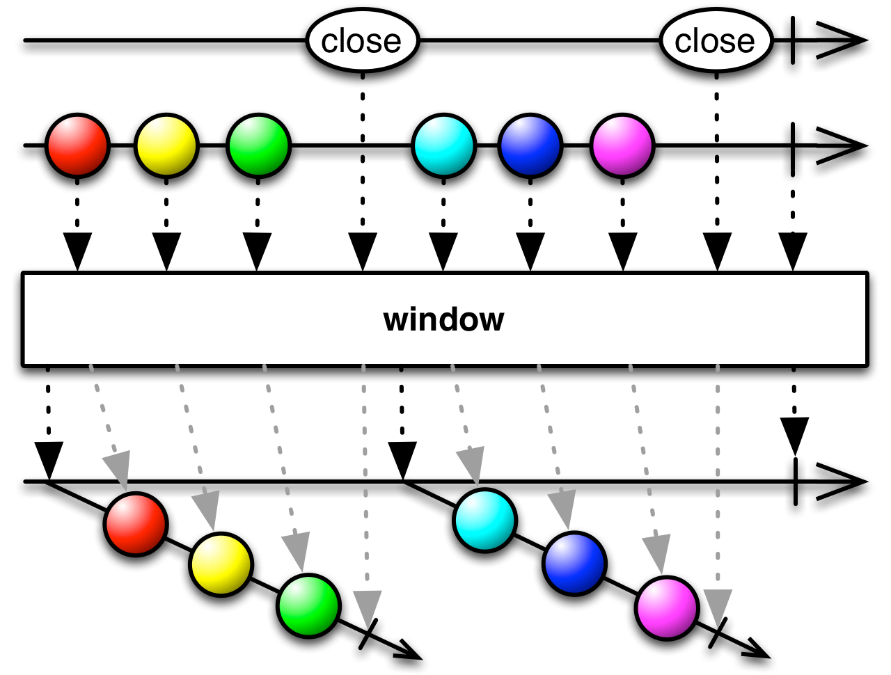
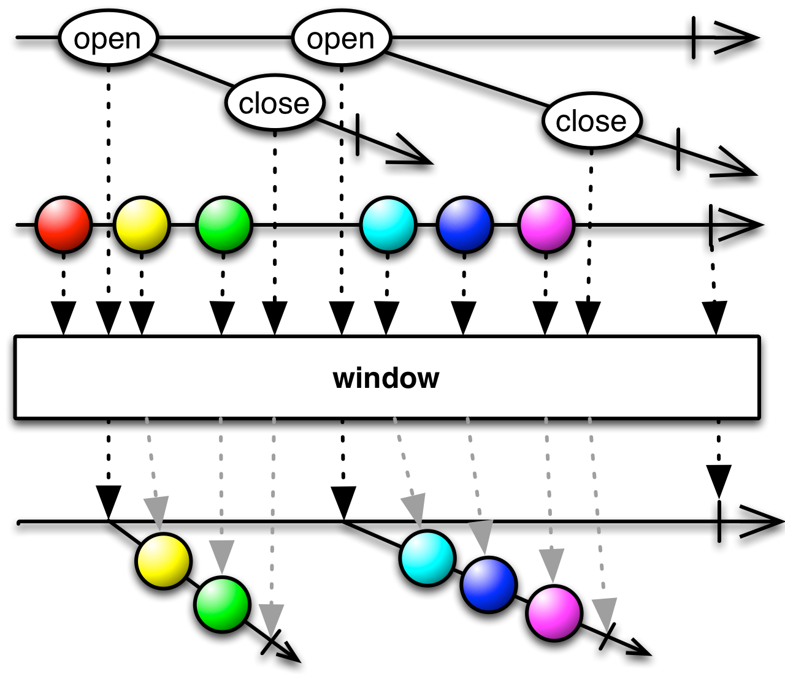
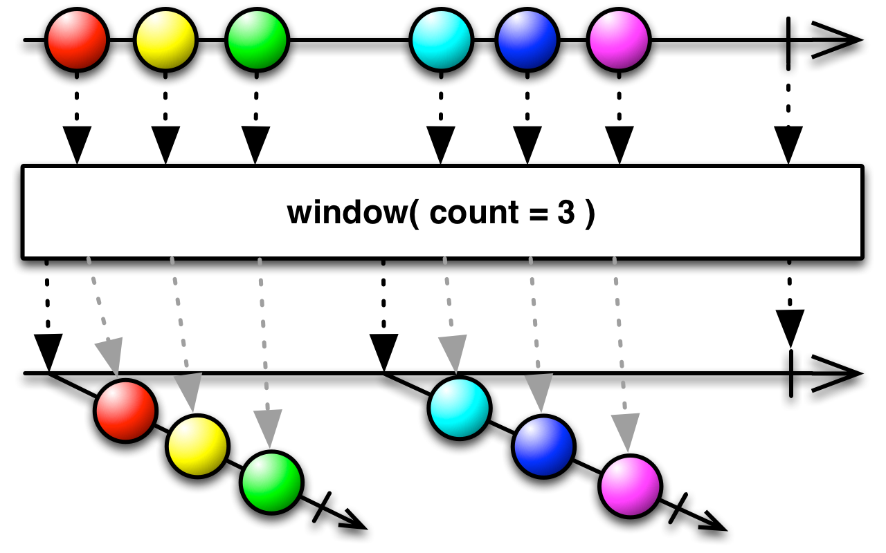
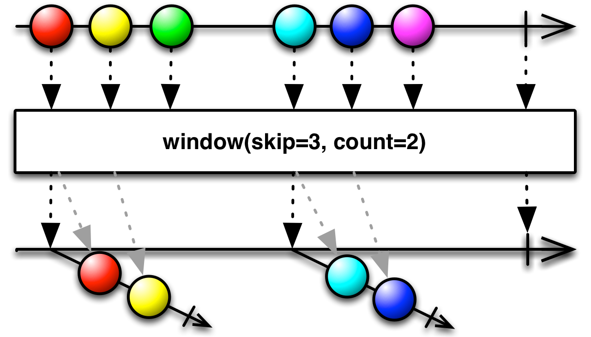
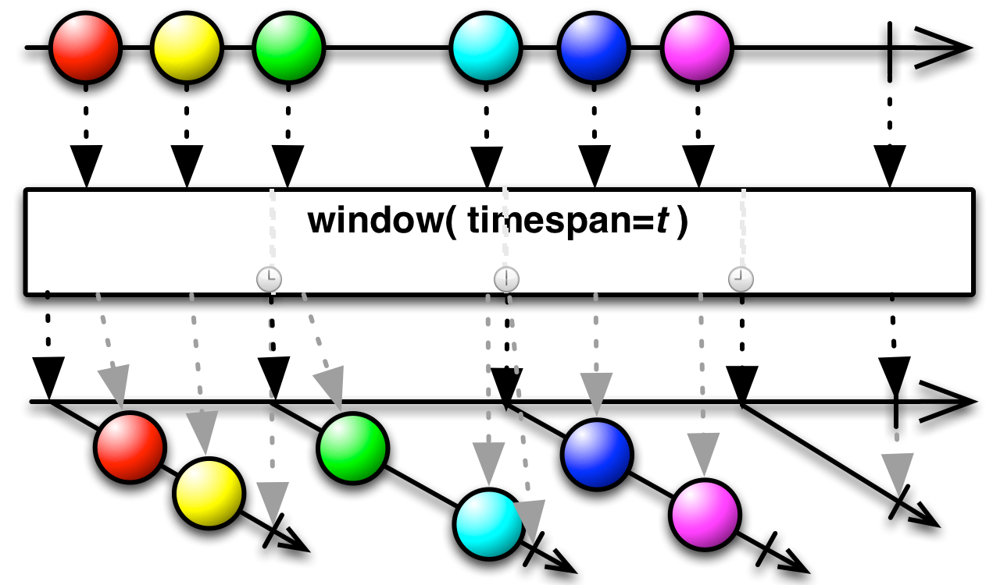
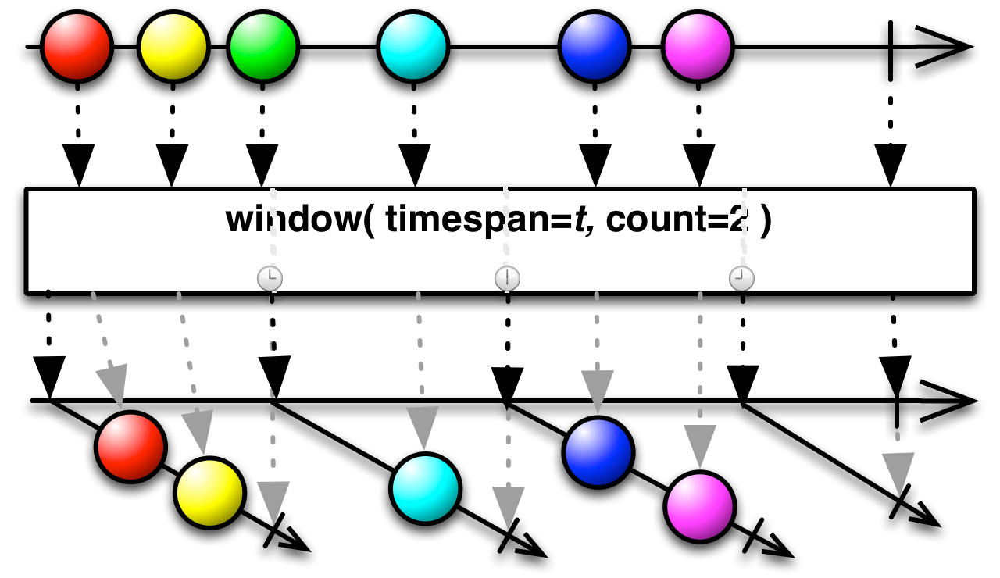
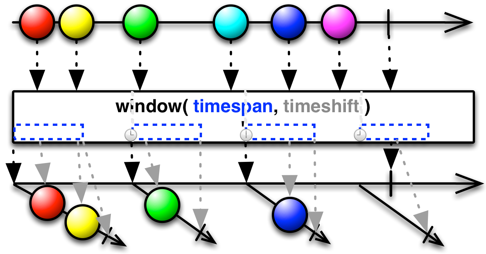
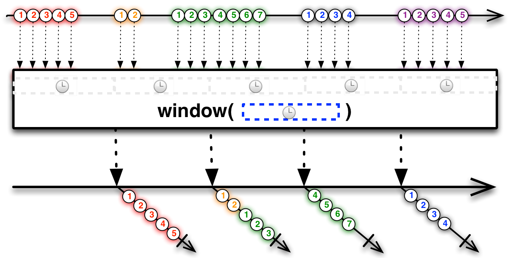
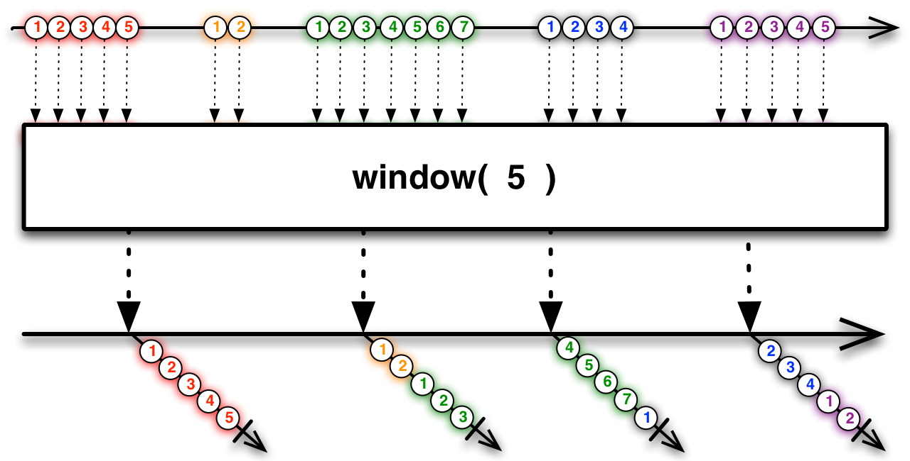

## Window
定期将来自原始Observable的数据分解为个Observable窗口，发送这些窗口，而不是每次发送一项数据


`Window`和`Buffer`类似，但不是发送来自原始Observable的数据包，它发送的是Observables，这些Observables中的每一个都发送原始Observable数据的一个子集，最后发送一个`onCompleted`通知。

和`Buffer`一样，`Window`有很多变体，每一种都以自己的方式将原始Observable分解为多个作为结果的Observable，每一个都包含一个映射原始数据的`window`。用`Window`操作符的术语描述就是，当一个窗口打开(when a window "opens")意味着一个新的Observable已经发送（产生）了，而且这个Observable开始发送来自原始Observable的数据；当一个窗口关闭(when a window "closes")意味着发送(产生)的Observable停止发送原始Observable的数据，并且发送结束通知`onCompleted`给它的观察者们。

在RxJava中有许多种`Window`操作符的变体。

### window(closingSelector)



`window`的这个变体会立即打开它的第一个窗口。每当它观察到`closingSelector`返回的Observable发送了一个对象时，它就关闭当前打开的窗口并立即打开一个新窗口。用这个方法，这种`window`变体发送一系列不重叠的窗口，这些窗口的数据集合与原始Observable发送的数据是一一对应的。

* Javadoc: [window(Func0)](http://reactivex.io/RxJava/javadoc/rx/Observable.html#window(rx.functions.Func0))

### window(windowOpenings, closingSelector)



无论何时，只要`window`观察到`windowOpenings`这个Observable发送了一个`Opening`对象，它就打开一个窗口，并且同时调用`closingSelector`生成一个与那个窗口关联的关闭(closing)Observable。当这个关闭(closing)Observable发送了一个对象时，`window`操作符就会关闭那个窗口。对这个变体来说，由于当前窗口的关闭和新窗口的打开是由单独的Observable管理的，它创建的窗口可能会存在重叠（重复某些来自原始Observable的数据）或间隙（丢弃某些来自原始Observable的数据）。

* Javadoc: [window(Observable,Func1)](http://reactivex.io/RxJava/javadoc/rx/Observable.html#window(rx.Observable,%20rx.functions.Func1))

### window(count)



这个`window`的变体立即打开它的第一个窗口。每当当前窗口发送了`count`项数据，它就关闭当前窗口并打开一个新窗口。如果从原始Observable收到了`onError`或`onCompleted`通知它也会关闭当前窗口。这种`window`变体发送一系列不重叠的窗口，这些窗口的数据集合与原始Observable发送的数据是一一对应的。

* Javadoc: [window(int)](http://reactivex.io/RxJava/javadoc/rx/Observable.html#window(int))

### window(count, skip)



这个`window`的变体立即打开它的第一个窗口。原始Observable每发送`skip`项数据它就打开一个新窗口（例如，如果`skip`等于3，每到第三项数据，它会打开一耳光新窗口）。每当当前窗口发送了`count`项数据，它就关闭当前窗口并打开一个新窗口。如果从原始Observable收到了`onError`或`onCompleted`通知它也会关闭当前窗口。如果`skip=count`，它的行为与`window(source, count)`相同；如果`skip < count`，窗口可会有`count - skip` 个重叠的数据；如果`skip > count`，在两个窗口之间会有`skip - count`项数据被丢弃。

* Javadoc: [window(int,int)](http://reactivex.io/RxJava/javadoc/rx/Observable.html#window(int,%20int))

### window(timespan, unit[, scheduler])



这个`window`的变体立即打开它的第一个窗口。每当过了`timespan`这么长的时间它就关闭当前窗口并打开一个新窗口（时间单位是`unit`，可选在调度器`scheduler`上执行）。如果从原始Observable收到了`onError`或`onCompleted`通知它也会关闭当前窗口。这种`window`变体发送一系列不重叠的窗口，这些窗口的数据集合与原始Observable发送的数据也是一一对应的。

* Javadoc: [window(long,TimeUnit)](http://reactivex.io/RxJava/javadoc/rx/Observable.html#window(long,%20java.util.concurrent.TimeUnit))
* Javadoc: [window(long,TimeUnit,Scheduler)](http://reactivex.io/RxJava/javadoc/rx/Observable.html#window(long,%20java.util.concurrent.TimeUnit,%20rx.Scheduler))

### window(timespan, unit, count[, scheduler])



这个`window`的变体立即打开它的第一个窗口。这个变体是`window(count)`和`window(timespan, unit[, scheduler])`的结合，每当过了`timespan`的时长或者当前窗口收到了`count`项数据，它就关闭当前窗口并打开另一个。如果从原始Observable收到了`onError`或`onCompleted`通知它也会关闭当前窗口。这种`window`变体发送一系列不重叠的窗口，这些窗口的数据集合与原始Observable发送的数据也是一一对应的。

* Javadoc: [window(long,TimeUnit,int)](http://reactivex.io/RxJava/javadoc/rx/Observable.html#window(long,%20java.util.concurrent.TimeUnit,%20int))
* Javadoc: [window(long,TimeUnit,int,Scheduler)](http://reactivex.io/RxJava/javadoc/rx/Observable.html#window(long,%20java.util.concurrent.TimeUnit,%20int,%20rx.Scheduler))

### window(timespan, timeshift, unit[, scheduler])



`buffer(timespan, timeshift, unit)`在每一个`timeshift`时期内都创建一个新的`List`,然后用原来Observable发送的每一项数据填充这个列表（在把这个`List`当做自己的数据发送前，从创建时开始，直到过了`timespan`这么长的时间）。如果`timespan`长于`timeshift`，它发送的数据包将会重叠，因此可能包含重复的数据项。

这个`window`的变体立即打开它的第一个窗口。随后每当过了`timeshift`的时长就打开一个新窗口（时间单位是`unit`，可选在调度器`scheduler`上执行），当窗口打开的时长达到`timespan`，它就关闭当前打开的窗口。如果从原始Observable收到了`onError`或`onCompleted`通知它也会关闭当前窗口。窗口的数据可能重叠也可能有间隙，取决于你设置的`timeshift`和`timespan`的值。

这个变体的`window`默认在`computation`调度器上执行它的定时器。

* Javadoc: [window(long,long,TimeUnit)](http://reactivex.io/RxJava/javadoc/rx/Observable.html#window(long,%20long,%20java.util.concurrent.TimeUnit))
* Javadoc: [window(long,long,TimeUnit,Scheduler)](http://reactivex.io/RxJava/javadoc/rx/Observable.html#window(long,%20long,%20java.util.concurrent.TimeUnit,%20rx.Scheduler))

### window-backpressure

你可以使用`Window`操作符实现反压`backpressure`（意思是，处理这样一个Observable：它产生数据的数据可能比它的观察者消费数据的数据快）。



Window操作符可以将大量的数据序列缩减为较少的数据窗口序列，让它们更容易处理。例如，你可以按固定的时间间隔，定期关闭和发送来自一个爆发性Observable的数据窗口。

示例代码

```java
Observable<Observable<Integer>> burstyWindowed = bursty.window(500, TimeUnit.MILLISECONDS);
```



你还可以选择每当收到爆发性Observable的N项数据时发送一个新的数据窗口。

示例代码

```java
Observable<Observable<Integer>> burstyWindowed = bursty.window(5);
```

