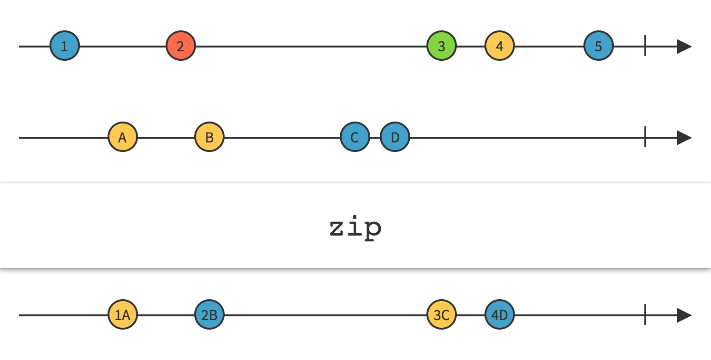

# 结合操作

## Zip

通过一个函数将多个Observables的发射物结合到一起，基于这个函数的结果为每个结合体发射单个数据项。

`Zip`操作符返回一个Obversable，它使用这个函数按顺序结合两个或多个Observables发送的数据项，然后它发射这个函数返回的结果。它按照严格的顺序应用这个函数。它只发送与发送数据项最少的那个Observable一样多的数据。

RxJava将这个操作符实现为`zip`和`zipWith`。

`zip`的最后一个参数接受每个Observable发送的一项数据，返回被压缩后的数据，它可以接受一到九个参数：一个Observable序列，或者一些发射Observable的Observables。

* Javadoc: [zip(Iterable<Observable>,FuncN)](http://reactivex.io/RxJava/javadoc/rx/Observable.html#zip(java.lang.Iterable,%20rx.functions.FuncN))
* Javadoc: [zip(Observable<Observable>,FuncN)](http://reactivex.io/RxJava/javadoc/rx/Observable.html#zip(rx.Observable,%20rx.functions.FuncN))
* Javadoc: [zip(Observable,Observable,Func2)](http://reactivex.io/RxJava/javadoc/rx/Observable.html#zip(rx.Observable,%20rx.Observable,%20rx.functions.Func2)) (最多可以有九个Observables参数)

### zipWith

`zipWith`操作符总是接受两个参数，第一个参数是一个Observable或者一个Iterable。

* Javadoc: [zipWith(Observable,Func2)](http://reactivex.io/RxJava/javadoc/rx/Observable.html#zipWith(rx.Observable,%20rx.functions.Func2))
* Javadoc: [zipWith(Iterable,Func2)](http://reactivex.io/RxJava/javadoc/rx/Observable.html#zipWith(java.lang.Iterable,%20rx.functions.Func2))

`zip`和`zipWith`默认不在任何特定的操作符上执行。
