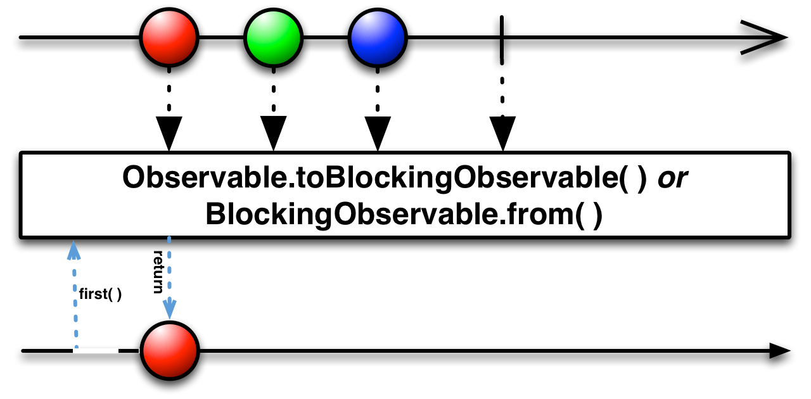
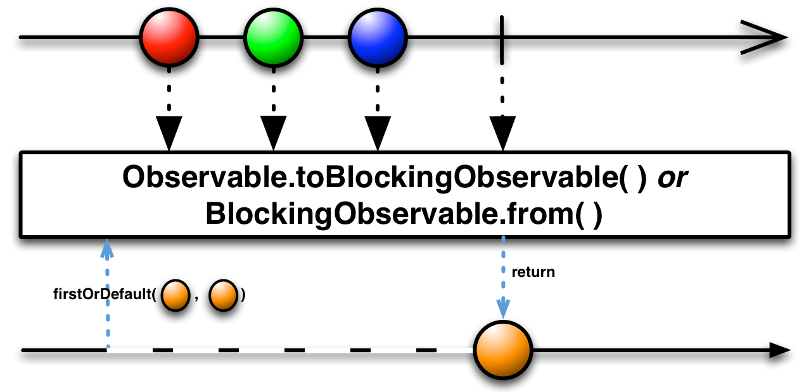
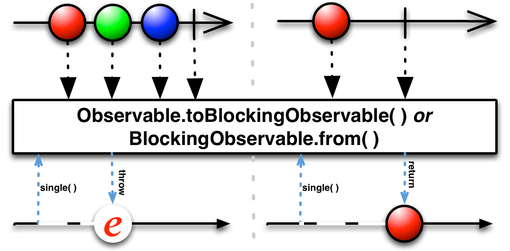
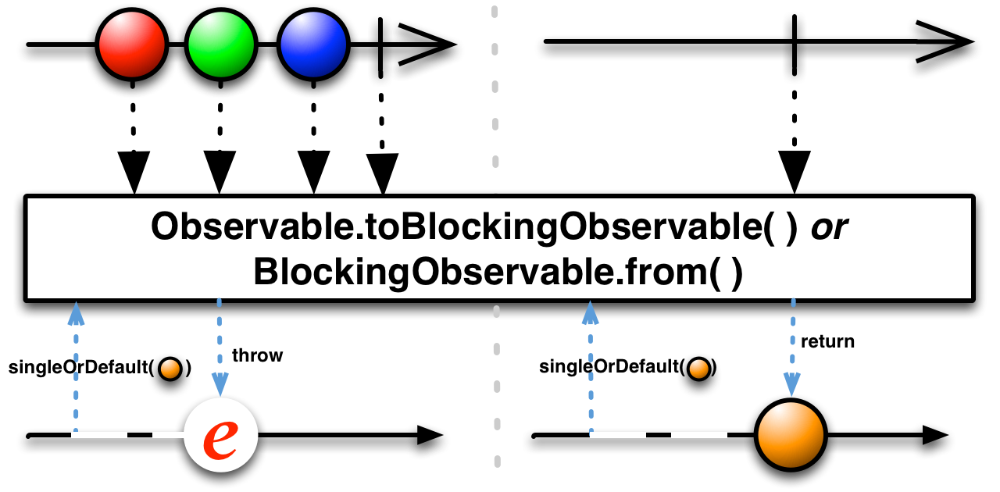

这一节解释 [`BlockingObservable`](http://reactivex.io/RxJava/javadoc/rx/observables/BlockingObservable.html) 的子类. 一个阻塞的Observable 继承普通的Observable类，增加了一些可用于阻塞Observable发射的数据的操作符。

要将一个普通的`Observable` 转换为 `BlockingObservable`，可以使用 [`Observable.toBlocking( )`](http://reactivex.io/RxJava/javadoc/rx/Observable.html#toBlocking()) 方法或者[`BlockingObservable.from( )`](http://reactivex.io/RxJava/javadoc/rx/observables/BlockingObservable.html#from(rx.Observable)) 方法。

* [**`forEach( )`**](Subscribe.md) — 对Observable发射的每一项数据调用一个方法，会阻塞直到Observable完成
* [**`first( )`**](First.md) — 阻塞直到Observable发射了一个数据，然后返回第一项数据
* [**`firstOrDefault( )`**](First.md) — 阻塞直到Observable发射了一个数据或者完成，返回第一项数据，或者返回默认值
* [**`last( )`**](Last.md) — 阻塞直到Observable完成，然后返回最后一项数据
* [**`lastOrDefault( )`**](Last.md) — 阻塞直到Observable完成，然后返回最后一项的数据，或者返回默认值
* [**`mostRecent( )`**](First.md) — 返回一个总是返回Observable最近发射的数据的iterable
* [**`next( )`**](TakeLast.md) — 返回一个iterable，会阻塞直到Observable发射了另一个值，然后返回那个值
* [**`latest( )`**](First.md) — 返回一个iterable，会阻塞直到或者除非Observable发射了一个iterable没有返回的值，然后返回这个值
* [**`single( )`**](First.md) — 如果Observable完成时只发射了一个值，返回那个值，否则抛出异常
* [**`singleOrDefault( )`**](First.md) — 如果Observable完成时只发射了一个值，返回那个值，否则否好默认值
* [**`toFuture( )`**](To.md) — 将Observable转换为一个Future
* [**`toIterable( )`**](To.md) — 将一个发射数据序列的Observable转换为一个Iterable
* [**`getIterator( )`**](To.md) — 将一个发射数据序列的Observable转换为一个Iterator

> 伴随这个解释还有一个修改版的弹珠图，这里就是表示阻塞Observable的弹珠图：

## BlockingObservable的方法

`BlockingObservable`的方法不是将一个Observable变换为另一个，也不是过滤Observables，它们会打断Observable的调用链，会阻塞等待直到Observable发射了它们想要的数据，然后返回这个数据（而不是一个Observable）。

要将一个Observable转换为一个`BlockingObservable`，你可以使用这些方法，使用`Observable.toBlocking`或`BlockingObservable.from`方法。

* Javadoc: [Observable.toBlocking()](http://reactivex.io/RxJava/javadoc/rx/Observable.html#toBlocking())
* Javadoc: [BlockingObservable.from(Observable)](http://reactivex.io/RxJava/javadoc/rx/observables/BlockingObservable.html#from(rx.Observable))

### first

要获取`BlockingObservable`的发射物，使用无参数的`first`方法。

* Javadoc: [BlockingObservable.first()](http://reactivex.io/RxJava/javadoc/rx/observables/BlockingObservable.html#first())

### first.p

你也可以给`first`方法传递一个谓词函数用于获取满足条件的`BlockingObservable`。

* Javadoc: [BlockingObservable.first(Func1)](http://reactivex.io/RxJava/javadoc/rx/observables/BlockingObservable.html#first(rx.functions.Func1))

### firstOrDefault

和过滤操作符一样，如果原始Observable没有数据，`first`会抛出异常`NoSuchElementException`，`firstOrDefault`会返回一个默认值。

* Javadoc: [BlockingObservable.firstOrDefault()](http://reactivex.io/RxJava/javadoc/rx/observables/BlockingObservable.html#firstOrDefault(T))

### firstOrDefault.p

`firstOrDefault`同样也接受一个谓词函数作为参数，用于获取满足条件的第一项，如果没有满足条件的就返回默认值。

* Javadoc: [BlockingObservable.firstOrDefault(T, Func1)](http://reactivex.io/RxJava/javadoc/rx/observables/BlockingObservable.html#firstOrDefault(T,%20rx.functions.Func1))

### single

`single`和`first`类似，但是如果不是正好发射一个数据，会抛出异常`NoSuchElementException`。其它几个变体的功能也是类似的。

* Javadoc: [single()](http://reactivex.io/RxJava/javadoc/rx/observables/BlockingObservable.html#single())

### single.p

同上，接受一个谓词函数，如果满足条件的不是正好一个，会抛出异常。

* Javadoc: [single(Func1)](http://reactivex.io/RxJava/javadoc/rx/observables/BlockingObservable.html#single(rx.functions.Func1))

### singleOrDefault

类似`firstOrDefault`，在为空时返回默认值，超过一个就抛出异常。

* Javadoc: [singleOrDefault(T)](http://reactivex.io/RxJava/javadoc/rx/observables/BlockingObservable.html#singleOrDefault(T))

### singleOrDefault.p

类似`firstOrDefault`，接受一个谓词函数，如果没有复合条件的，返回默认值；如果有多个复合条件的，以错误通知终止。

* Javadoc: [singleOrDefault(Func1,T)](http://reactivex.io/RxJava/javadoc/rx/observables/BlockingObservable.html#singleOrDefault(rx.functions.Func1,%20T))

### next

`next`操作符会阻塞直到`BlockingObservable`返回另外一个值，然后它返回那个值。你可以重复调用这个方法从`BlockingObservable`获取后续的数据项。以阻塞的方式高效的迭代获取它的发射物。

`latest`操作符也是类似的，但是它不会阻塞等待下一个值，它立即返回最近发射的数据项，只在Observable还没有发射任何数据时会阻塞。

* Javadoc: [next()](http://reactivex.io/RxJava/javadoc/rx/observables/BlockingObservable.html#next())
* Javadoc: [latest()](http://reactivex.io/RxJava/javadoc/rx/observables/BlockingObservable.html#latest())

### mostRecent

`mostRecent`操作符让你可以用类似的方式迭代一个`BlockingObservable`，但是它总是立即返回一个值，或者是默认值（如果`BlockingObservable`还没有发射任何数据），或者是`BlockingObservable`最近发射的数据项。

* Javadoc: [mostRecent(T)](http://reactivex.io/RxJava/javadoc/rx/observables/BlockingObservable.html#mostRecent(T))

### forEach

`BlockingObservable`类中也有一个类似的叫作`forEach`的方法。要使用这个方法，你首先需要使用`BlockingObservable.from`方法或`Observable.toBlocking`操作符将原始Observable转换为一个`BlockingObservable`。

`BlockingObservable.forEach`接受单个函数作为参数，这个函数的作用类似于普通Observable订阅中的`onNext`函数。`forEach`自身会阻塞知道`BlockingObservable`完成，当它不阻塞时就是完成了，不是通过调用一个回调方法表示它完成了。如果遇到了错误它将抛出一个`RuntimeException`（而不是调用一个类似于`onError`的回调方法）。

* Javadoc: [BlockingObservable.forEach(Action1)](http://reactivex.io/RxJava/javadoc/rx/observables/BlockingObservable.html#forEach(rx.functions.Action1))

#### 参见：
* javadoc: <a href="http://reactivex.io/RxJava/javadoc/rx/observables/BlockingObservable.html">`BlockingObservable`</a>
* javadoc: <a href="http://reactivex.io/RxJava/javadoc/rx/Observable.html#toBlocking()">`toBlocking()`</a>
* javadoc: <a href="http://reactivex.io/RxJava/javadoc/rx/observables/BlockingObservable.html#from(rx.Observable)">`BlockingObservable.from()`</a>

## 附录：相似的阻塞和非阻塞操作符列表

<table>
 <thead>
  <tr><th rowspan="2">操作符</th><th colspan="3">执行结果</th><th rowspan="2">Rx.NET等价操作</th></tr>
  <tr><th>发射多个数据的Observable</th><th>发射单个数据的Observable</th><th>不发射数据的Observable</th></tr>
 </thead>
 <tbody>
  <tr><td><code>Observable.first</code></td><td> 第一项</td><td>单个数据</td><td><i>该元素不存在</i></td><td><code>firstAsync</code></td></tr>
  <tr><td><code>BlockingObservable.first</code></td><td> 第一项</td><td>单个数据</td><td><i>该元素不存在</i></td><td><code>first</code></td></tr>
  <tr><td><code>Observable.firstOrDefault</code></td><td> 第一项</td><td>单个数据</td><td>默认数据</td><td><code>firstOrDefaultAsync</code></td></tr>
  <tr><td><code>BlockingObservable.firstOrDefault</code></td><td> 第一项</td><td>单个数据</td><td>默认数据</td><td><code>firstOrDefault</code></td></tr>
  <tr><td><code>Observable.last</code></td><td>最后一项</td><td>单个数据</td><td><i>该元素不存在</i></td><td><code>lastAsync</code></td></tr>
  <tr><td><code>BlockingObservable.last</code></td><td>最后一项</td><td>单个数据</td><td><i>该元素不存在</i></td><td><code>last</code></td></tr>
  <tr><td><code>Observable.lastOrDefault</code></td><td>最后一项</td><td>单个数据</td><td>默认数据</td><td><code>lastOrDefaultAsync</code></td></tr>
  <tr><td><code>BlockingObservable.lastOrDefault</code></td><td>最后一项</td><td>单个数据</td><td>默认数据</td><td><code>lastOrDefault</code></td></tr>
  <tr><td><code>Observable.single</code></td><td><i>非法参数</i></td><td>单个数据</td><td><i>该元素不存在</i></td><td><code>singleAsync</code></td></tr>
  <tr><td><code>BlockingObservable.single</code></td><td><i>非法参数</i></td><td>单个数据</td><td><i>该元素不存在</i></td><td><code>single</code></td></tr>
  <tr><td><code>Observable.singleOrDefault</code></td><td><i>非法参数</i></td><td>单个数据</td><td>默认数据</td><td><code>singleOrDefaultAsync</code></td></tr>
  <tr><td><code>BlockingObservable.singleOrDefault</code></td><td><i>非法参数</i></td><td>单个数据</td><td>默认数据</td><td><code>singleOrDefault</code></td></tr>
 </tbody>
</table>
