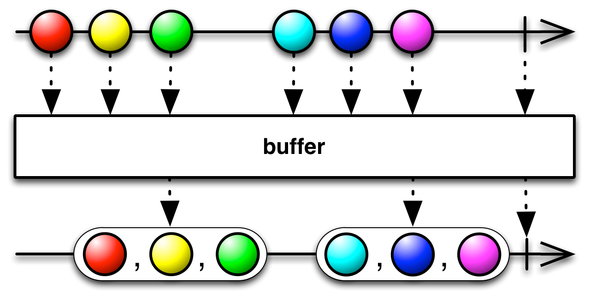
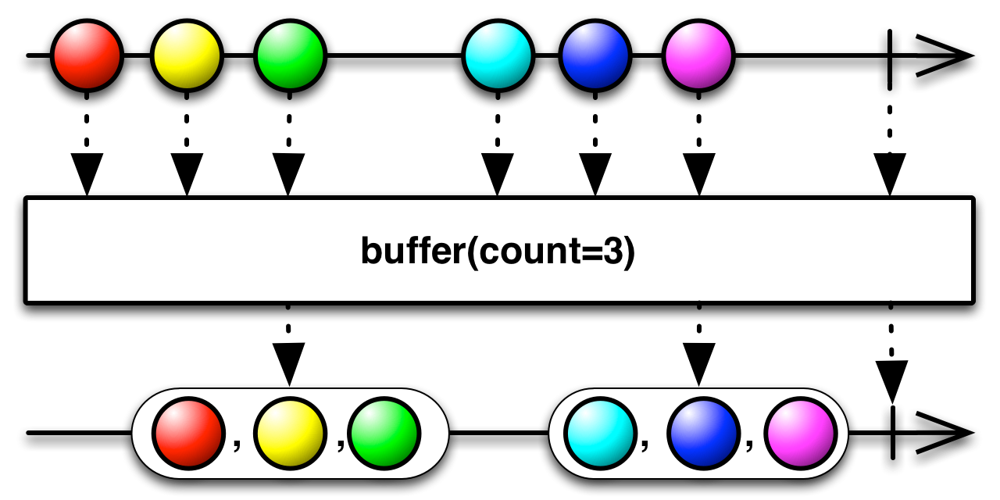
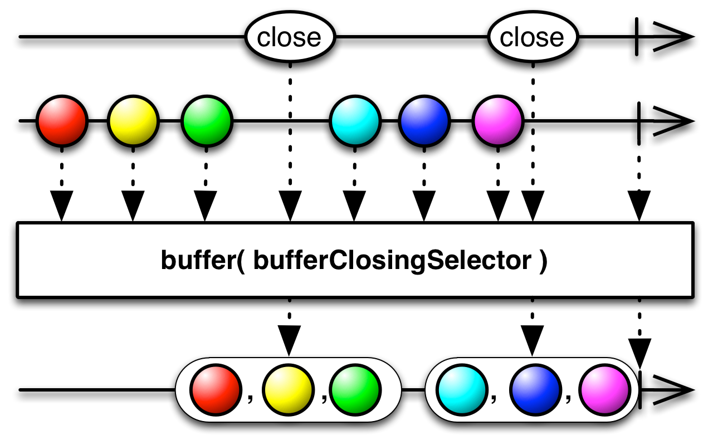
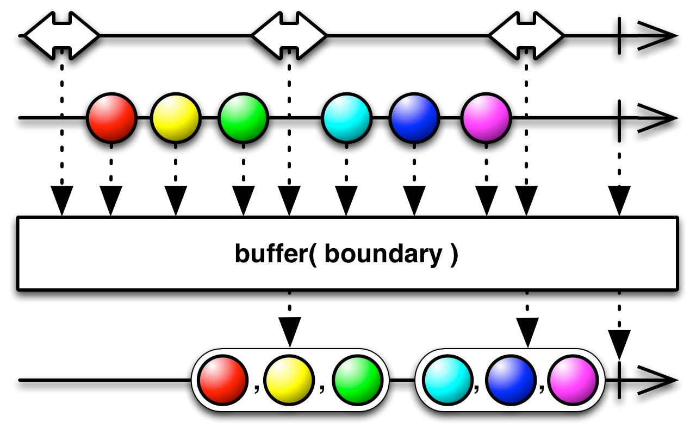
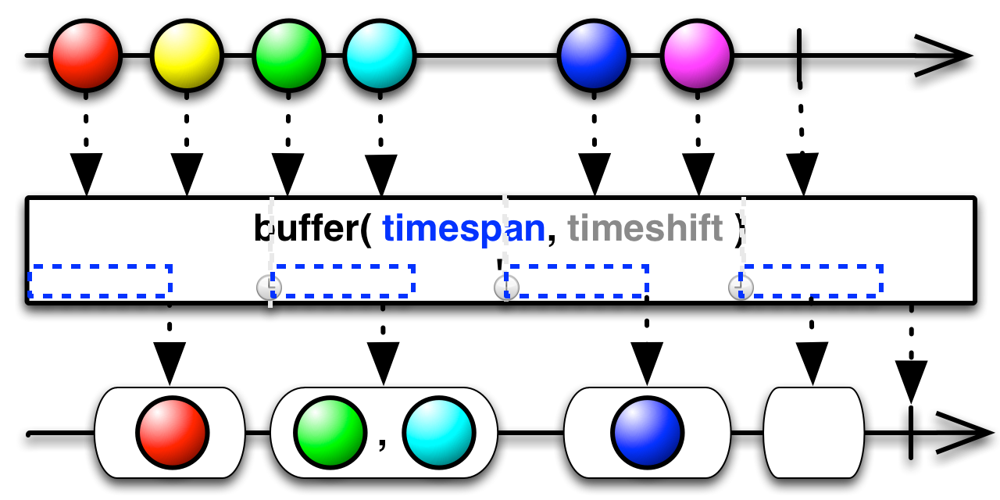

## Buffer

定期收集来自一个Observable的数据放进一个数据包裹，然后发送这些数据包裹，而不是一次发送一个值。



`Buffer`操作符将一个Observable变换为另一个，原来的Observable正常发送数据，变换产生的Observable发送这些数据的缓存集合。`Buffer`操作符在很多语言特定的实现中有很多种变体，它们在如何缓存这个问题上存在区别。

注意：如果原来的Observable发送了一个`onError`通知，`Buffer`会立即传递这个通知，而不是首先发送缓存的数据，即使在这之前缓存中包含了原来Observable发送的数据。

`Window`操作符与`Buffer`类似，但是它在发送之前把收集到的数据放进单独的Observable，而不是放进一个数据结构。

在RxJava中有许多`Buffer`的变体：

### buffer(count)



`buffer(count)`以列表(List)的形式发送非重叠的缓存，每一个缓存至多包含来自原来Observable的count项数据（最后发送的列表数据可能少于count项）

* Javadoc: [buffer(int)](http://reactivex.io/RxJava/javadoc/rx/Observable.html#buffer(int))

### buffer(count, skip)


`buffer(count, skip)`从原来Observable的第一项数据开始创建新的缓存，此后每当收到`skip`项数据，用`count`项数据填充缓存：开头的一项和后续的`count-1`项，它以列表(List)的形式发送缓存，取决于`count`和`skip`的值，这些缓存可能会有重叠部分（比如skip<count时），也可能会有间隙（比如skip>count时）。

* Javadoc: [buffer(int,int)](http://reactivex.io/RxJava/javadoc/rx/Observable.html#buffer(int,%20int))

### buffer(bufferClosingSelector)



当它订阅原来的Observable时，`buffer(bufferClosingSelector)`开始将数据收集到一个`List`，然后它调用`bufferClosingSelector`生成第二个Observable，当第二个Observable发送一个`TClosing`时，`buffer`发送当前的`List`，然后重复这个过程：开始组装一个新的`List`，然后调用`bufferClosingSelector`创建一个新的Observable并监视它。它会一直这样做直到原来的Observable执行完成。

* Javadoc: [buffer(Func0)](http://reactivex.io/RxJava/javadoc/rx/Observable.html#buffer(rx.functions.Func0))

### buffer(boundary)



`buffer(boundary)`监视一个名叫`boundary`的Observable，每当这个Observable发送了一个值，它就创建一个新的`List`开始收集来自原来Observable的数据并发送原来的`List`。

* Javadoc: [buffer(Observable)](http://reactivex.io/RxJava/javadoc/rx/Observable.html#buffer(rx.Observable))
* Javadoc: [buffer(Observable,int)](http://reactivex.io/RxJava/javadoc/rx/Observable.html#buffer(rx.Observable,%20int))

### buffer(bufferOpenings, bufferClosingSelector)


`buffer(bufferOpenings, bufferClosingSelector)`监视这个叫`bufferOpenings`的Observable（它发送`BufferOpening`对象），每当`bufferOpenings`发送了一个数据时，它就创建一个新的`List`开始手机来自原来Observable的数据，并将`bufferOpenings`传递给`closingSelector`函数。这个函数返回一个Observable。`buffer`监视这个Observable，当它检测到一个来自这个Observable的数据时，就关闭`List`并且发送它自己的数据（之前的那个List）。

* Javadoc: [buffer(Observable,Func1)](http://reactivex.io/RxJava/javadoc/rx/Observable.html#buffer(rx.Observable,%20rx.functions.Func1))

### buffer(timespan, unit[, scheduler])


`buffer(timespan, unit)`定期以`List`的形式发送新的数据，每个时间段，收集来自原Observable的数据（从前面一个数据包裹之后，或者如果是第一个数据包裹，从有观察者订阅原来的Observale之后开始）。还有另一个版本的`buffer`接受一个`Scheduler`参数，默认情况下会使用`computation`调度器。

* Javadoc: [buffer(long,TimeUnit)](http://reactivex.io/RxJava/javadoc/rx/Observable.html#buffer(long,%20java.util.concurrent.TimeUnit))
* Javadoc: [buffer(long,TimeUnit,Scheduler)](http://reactivex.io/RxJava/javadoc/rx/Observable.html#buffer(long,%20java.util.concurrent.TimeUnit,%20rx.Scheduler))

### buffer(timespan, unit, count[, scheduler])


每当收到来自原来Observable的count项数据，或者每过了一段指定的时间后，`buffer(timespan, unit, count)`就以`List`的形式发送这期间的数据，即使数据项少于count项。还有另一个版本的`buffer`接受一个`Scheduler`参数，默认情况下会使用`computation`调度器。

* Javadoc: [buffer(long,TimeUnit,int)](http://reactivex.io/RxJava/javadoc/rx/Observable.html#buffer(long,%20java.util.concurrent.TimeUnit,%20int))
* Javadoc: [buffer(long,TimeUnit,int,Scheduler)](http://reactivex.io/RxJava/javadoc/rx/Observable.html#buffer(long,%20java.util.concurrent.TimeUnit,%20int,%20rx.Scheduler))

### buffer(timespan, timeshift, unit[, scheduler])


 
`buffer(timespan, timeshift, unit)`在每一个`timeshift`时期内都创建一个新的`List`,然后用原来Observable发送的每一项数据填充这个列表（在把这个`List`当做自己的数据发送前，从创建时开始，直到过了`timespan`这么长的时间）。如果`timespan`长于`timeshift`，它发送的数据包将会重叠，因此可能包含重复的数据项。

还有另一个版本的`buffer`接受一个`Scheduler`参数，默认情况下会使用`computation`调度器。

* Javadoc: [buffer(long,long,TimeUnit)](http://reactivex.io/RxJava/javadoc/rx/Observable.html#buffer(long,%20long,%20java.util.concurrent.TimeUnit))
* Javadoc: [buffer(long,long,TimeUnit,Scheduler)](http://reactivex.io/RxJava/javadoc/rx/Observable.html#buffer(long,%20long,%20java.util.concurrent.TimeUnit,%20rx.Scheduler))

### buffer-backpressure

你可以使用`Buffer`操作符实现反压`backpressure`（意思是，处理这样一个Observable：它产生数据的数据可能比它的观察者消费数据的数据快）。


Buffer操作符可以将大量的数据序列缩减为较少的数据缓存序列，让它们更容易处理。例如，你可以按固定的时间间隔，定期关闭和发送来自一个爆发性Observable的数据缓存。这相当于一个缓冲区。

示例代码

```java
Observable<List<Integer>> burstyBuffered = bursty.buffer(500, TimeUnit.MILLISECONDS);
```


或者，如果你想更进一步，可以在爆发期将数据收集到缓存，然后在爆发期结束时发送这些数据，使用 [`Debounce`](Filtering-Operators#Debounce) 操作符给`buffer`操作符发送一个缓存关闭指示器(`buffer closing indicator`)可以做到这一点。

代码示例：

```java

// we have to multicast the original bursty Observable so we can use it
// both as our source and as the source for our buffer closing selector:
Observable<Integer> burstyMulticast = bursty.publish().refCount();
// burstyDebounced will be our buffer closing selector:
Observable<Integer> burstyDebounced = burstyMulticast.debounce(10, TimeUnit.MILLISECONDS);
// and this, finally, is the Observable of buffers we're interested in:
Observable<List<Integer>> burstyBuffered = burstyMulticast.buffer(burstyDebounced);

```

### 参见

* [DebouncedBuffer With RxJava by Gopal Kaushik](http://nerds.weddingpartyapp.com/tech/2015/01/05/debouncedbuffer-used-in-rxbus-example/) 
