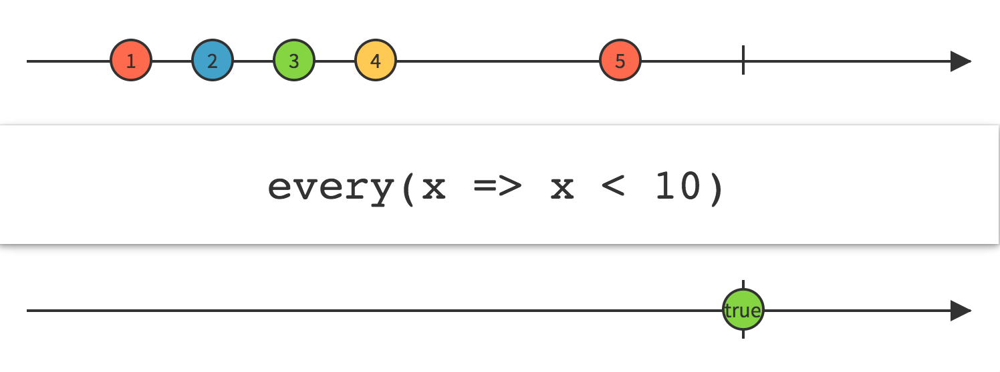
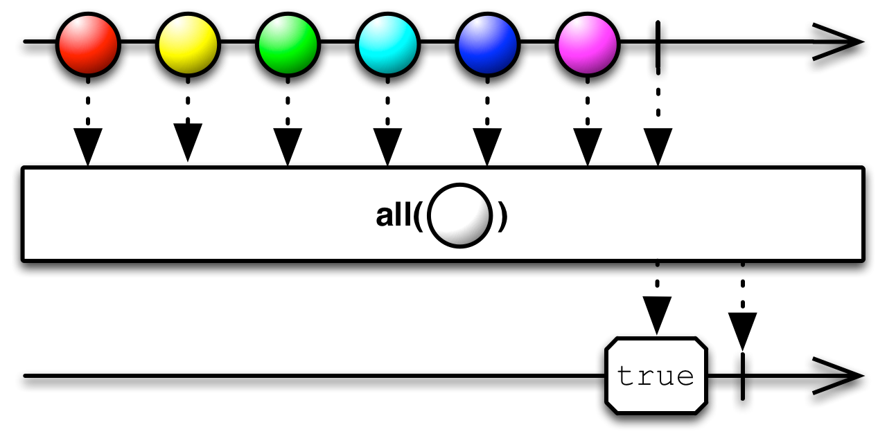
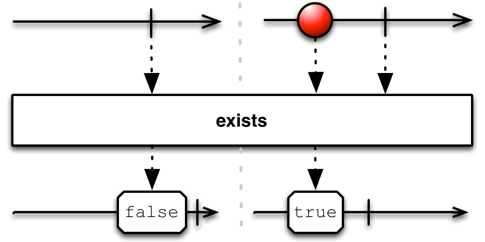
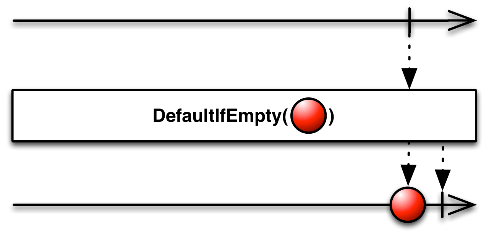
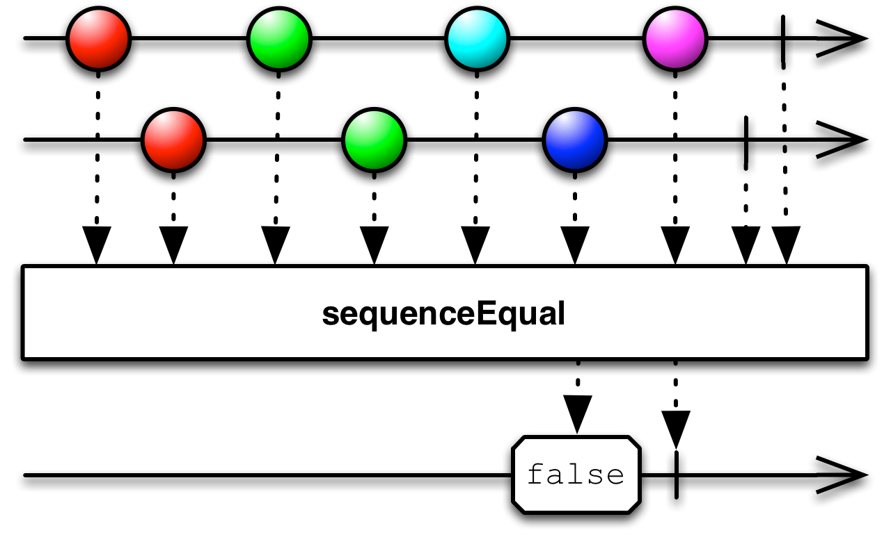
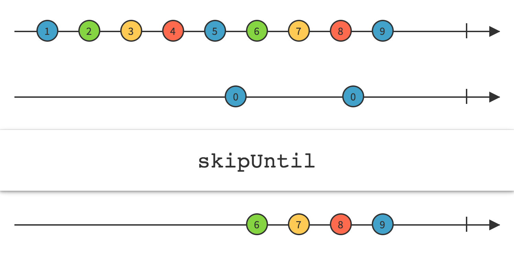
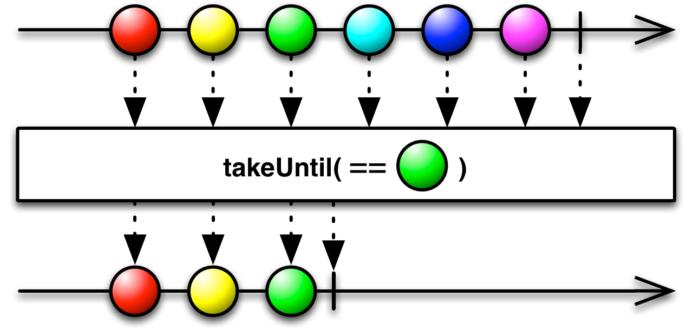
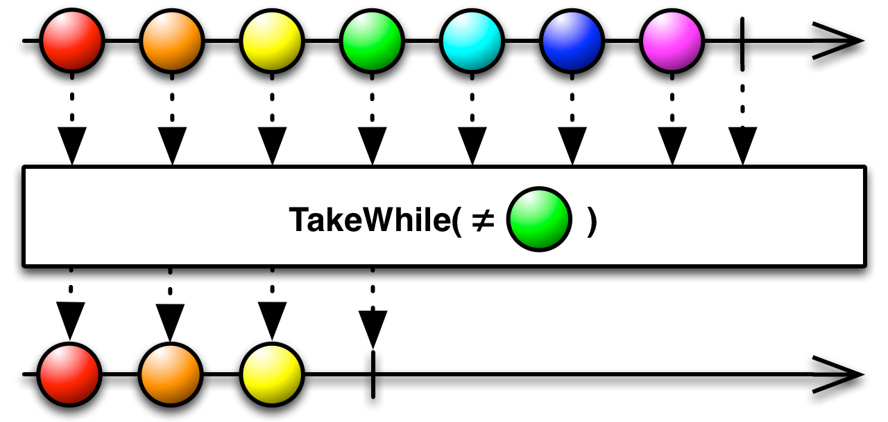

# 条件和布尔操作

## All

判定是否Observable发射的所有数据都满足某个条件

传递一个谓词函数给`All`操作符，这个函数接受原始Observable发射的数据，根据计算返回一个布尔值。`All`返回一个只发射一个单个布尔值的Observable，如果原始Observable正常终止并且每一项数据都满足条件，就返回true；如果原始Observable的任何一项数据不满足条件就返回False。

RxJava将这个操作符实现为`all`，它默认不在任何特定的调度器上执行。

* Javadoc: [all(Func1)](http://reactivex.io/RxJava/javadoc/rx/Observable.html#all(rx.functions.Func1))

## Amb

给定两个或多个Observables，它只发射首先发射数据或通知的那个Observable的所有数据

当你传递多个Observable给`Amb`时，它只发射其中一个Observable的数据和通知：首先发送通知给`Amb`的那个，不管发射的是一项数据还是一个`onError`或`onCompleted`通知。`Amb`将忽略和丢弃其它所有Observables的发射物。

RxJava的实现是`amb`，有一个类似的对象方法`ambWith`。例如，`Observable.amb(o1,o2)`和`o1.ambWith(o2)`是等价的。

这个操作符默认不在任何特定的调度器上执行。

## Contains

判定一个Observable是否发射一个特定的值

给`Contains`传一个指定的值，如果原始Observable发射了那个值，它返回的Observable将发射true，否则发射false。

相关的一个操作符`IsEmpty`用于判定原始Observable是否没有发射任何数据。

`contains`默认不在任何特定的调度器上执行。

* Javadoc: [contains(Object)](http://reactivex.io/RxJava/javadoc/rx/Observable.html#contains(java.lang.Object))

RxJava中还有一个`exists`操作符，它通过一个谓词函数测试原始Observable发射的数据，只要任何一项满足条件就返回一个发射true的Observable，否则返回一个发射false的Observable。

`exists`默认不在任何特定的调度器上执行。

* Javadoc: [exists(Func1)](http://reactivex.io/RxJava/javadoc/rx/Observable.html#exists(rx.functions.Func1))

`isEmpty`默认不在任何特定的调度器上执行。

* Javadoc: [isEmpty()](http://reactivex.io/RxJava/javadoc/rx/Observable.html#isEmpty())

## DefaultIfEmpty

发射来自原始Observable的值，如果原始Observable没有发射任何值，就发射一个默认值

`DefaultIfEmpty`简单的精确地发射原始Observable的值，如果原始Observable美欧发射任何数据正常终止（以`onCompleted`d的形式），`DefaultIfEmpty`返回的Observable就发射一个你提供的默认值。

RxJava将这个操作符实现为`defaultIfEmpty`。它默认不在任何特定的调度器上执行。

* Javadoc: [defaultIfEmpty(T)](http://reactivex.io/RxJava/javadoc/rx/Observable.html#defaultIfEmpty(T))

还有一个新的操作符`switchIfEmpty`，不在RxJava 1.0.0版中，它和`defaultIfEmtpy`类似，不同的是，如果原始Observable没有发射数据，它发射一个备用Observable的发射物。

## SequenceEqual

判定两个Observables是否发射相同的数据序列。

传递两个Observable给`SequenceEqual`操作符，它会比较两个Observable的发射物，如果两个序列是相同的（相同的数据，相同的顺序，相同的终止状态），它就发射true，否则发射false。

它还有一个版本接受第三个参数，可以传递一个函数用于比较两个数据项是否相同。

这个操作符默认不在任何特定的调度器上执行。

* Javadoc: [sequenceEqual(Observable,Observable)](http://reactivex.io/RxJava/javadoc/rx/Observable.html#sequenceEqual(rx.Observable,%20rx.Observable))
* Javadoc: [sequenceEqual(Observable,Observable,Func2)](http://reactivex.io/RxJava/javadoc/rx/Observable.html#sequenceEqual(rx.Observable,%20rx.Observable,%20rx.functions.Func2))

## SkipUntil

丢弃原始Observable发射的数据，直到第二个Observable发射了一项数据

`SkipUntil`订阅原始的Observable，但是忽略它的发射物，直到第二个Observable发射了一项数据那一刻，它开始发射原始Observable。

RxJava中对应的是`skipUntil`，它默认不在任何特定的调度器上执行。

* Javadoc: [skipUntil(Observable)](http://reactivex.io/RxJava/javadoc/rx/Observable.html#skipUntil(rx.Observable))

## SkipWhile

丢弃Observable发射的数据，直到一个指定的条件不成立

`SkipWhile`订阅原始的Observable，但是忽略它的发射物，直到你指定的某个天剑变为false的那一刻，它开始发射原始Observable。

`skipWhile`默认不在任何特定的调度器上执行。

* Javadoc: [skipWhile(Func1)](http://reactivex.io/RxJava/javadoc/rx/Observable.html#skipWhile(rx.functions.Func1))

## TakeUntil

当第二个Observable发射了一项数据或者终止时，丢弃原始Observable发射的任何数据

`TakeUntil`订阅并开始发射原始Observable，它还监视你提供的第二个Observable。如果第二个Observable发射了一项数据或者发射了一个终止通知，`TakeUntil`返回的Observable会停止发射原始Observable并终止。

RxJava中的实现是`takeUntil`。注意：第二个Observable发射一项数据或一个`onError`通知或一个`onCompleted`通知都会导致`takeUntil`停止发射数据。

`takeUntil`默认不在任何特定的调度器上执行。

* Javadoc: [takeUntil(Observable)](http://reactivex.io/RxJava/javadoc/rx/Observable.html#takeUntil(rx.Observable))

还有一个版本的`takeUntil `，不在RxJava 1.0.0版中，它使用一个谓词函数而不是第二个Observable来判定是否需要终止发射数据，它的行为类似于`takeWhile`。

* Javadoc: [takeUntil(Func1)](http://reactivex.io/RxJava/javadoc/rx/Observable.html#takeUntil(rx.functions.Func1))

## TakeWhile

发射Observable发射的数据，直到一个指定的条件不成立

`TakeWhile`发射原始Observable，直到你指定的某个条件不成立的那一刻，它停止发射原始Observable，并终止自己的Observable。

RxJava中的`takeWhile`操作符返回一个镜像原始Observable行为的Observable，直到某一项数据你指定的函数返回`false`那一刻，这个新的Observable发射`onCompleted`终止通知。

`takeWhile`默认不在任何特定的调度器上执行。

* Javadoc: [takeWhile(Func1)](http://reactivex.io/RxJava/javadoc/rx/Observable.html#takeWhile(rx.functions.Func1))
