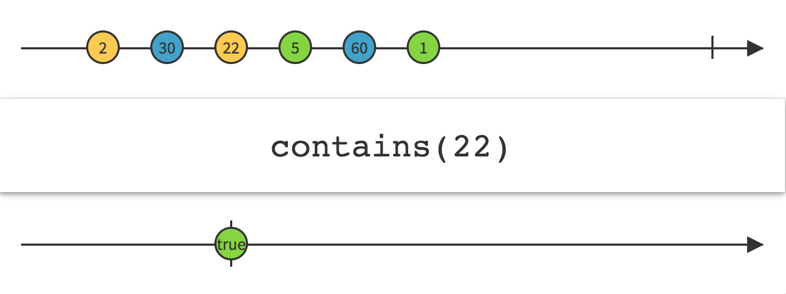
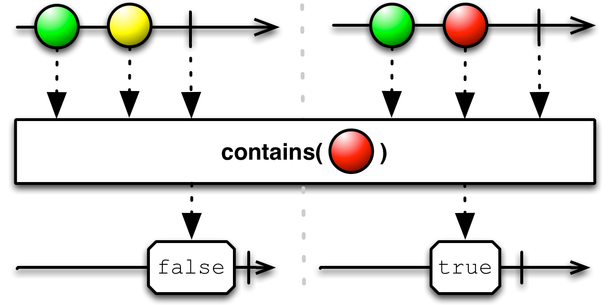
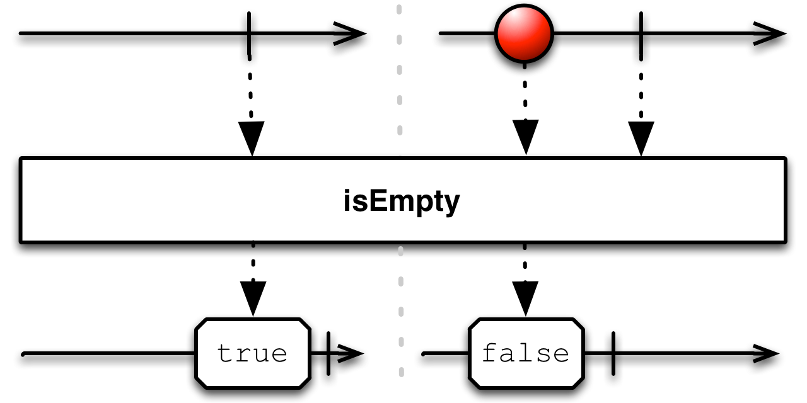

## Contains

判定一个Observable是否发送一个特定的值

给`Contains`传一个指定的值，如果原始Observable发射了那个值，它返回的Observable将发射true，否则发射false。

相关的一个操作符`IsEmpty`用于判定原始Observable是否没有发射任何数据。

`contains`默认不在任何特定的调度器上执行。

* Javadoc: [contains(Object)](http://reactivex.io/RxJava/javadoc/rx/Observable.html#contains(java.lang.Object))

RxJava中还有一个`exists`操作符，它通过一个谓词函数测试原始Observable反射的数据，只要任何一项满足条件就返回一个发射true的Observable，否则返回一个反射false的Observable。

`exists`默认不在任何特定的调度器上执行。

* Javadoc: [exists(Func1)](http://reactivex.io/RxJava/javadoc/rx/Observable.html#exists(rx.functions.Func1))

`isEmpty`默认不在任何特定的调度器上执行。

* Javadoc: [isEmpty()](http://reactivex.io/RxJava/javadoc/rx/Observable.html#isEmpty())
