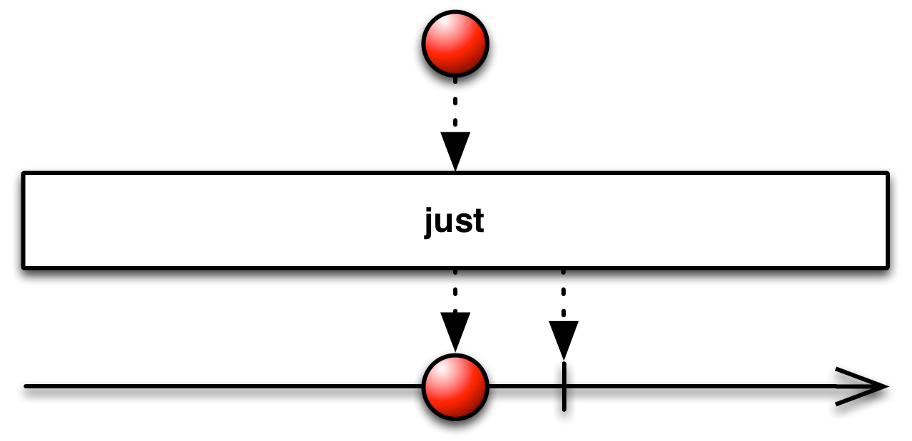

## Just

创建一个发射指定值的Observable



Just将单个数据转换为发射那个数据的Observable。

Just类似于From，但是From会将数组或Iterable的素具取出然后逐个发射，而Just只是简单的原样发射，将数组或Iterable当做单个数据。

注意：如果你传递`null`给Just，它会返回一个发射`null`值的Observable。不要误认为它会返回一个空Observable（完全不发射任何数据的Observable），如果需要空Observable你应该使用[Empty](#Empty)操作符。

RxJava将这个操作符实现为`just`函数，它接受一至九个参数，返回一个按参数列表顺序发射这些数据的Observable。

示例代码：

```java

Observable.just(1, 2, 3)
          .subscribe(new Subscriber<Integer>() {
        @Override
        public void onNext(Integer item) {
            System.out.println("Next: " + item);
        }

        @Override
        public void onError(Throwable error) {
            System.err.println("Error: " + error.getMessage());
        }

        @Override
        public void onCompleted() {
            System.out.println("Sequence complete.");
        }
    });

```

输出

```
Next: 1
Next: 2
Next: 3
Sequence complete.
```

* Javadoc: [just(item)](http://reactivex.io/RxJava/javadoc/rx/Observable.html#just(T)) (还有其它接受二到九个参数的版本)
