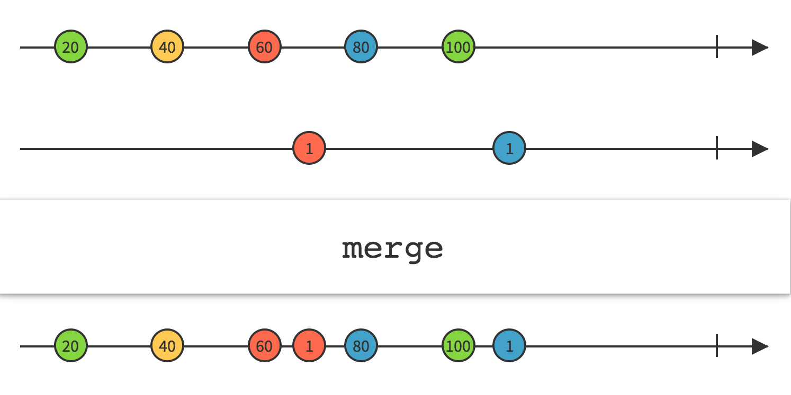

## Merge

合并多个Observables的发射物



使用`Merge`操作符你可以将多个Observables的输出合并，就好像它们是一个单个的Observable一样。

`Merge`可能会让合并的Observables发射的数据交错（有一个类似的操作符`Concat`不会让数据交错，它会按顺序一个接着一个发射多个Observables的发射物）。

正如图例上展示的，任何一个原始Observable的`onError`通知会被立即传递给观察者，而且会结束合并后的Observable。


在很多ReactiveX实现中还有一个叫`MergeDelayError`的操作符，它的行为有一点不同，它会保留`onError`通知直到合并后的Observable所有的数据发射完成，在那时它才会把`onError`传递给观察者。

RxJava将它实现为`merge`, `mergeWith`和`mergeDelayError`。


示例代码

```java

Observable<Integer> odds = Observable.just(1, 3, 5).subscribeOn(someScheduler);
Observable<Integer> evens = Observable.just(2, 4, 6);

Observable.merge(odds, evens)
          .subscribe(new Subscriber<Integer>() {
        @Override
        public void onNext(Integer item) {
            System.out.println("Next: " + item);
        }

        @Override
        public void onError(Throwable error) {
            System.err.println("Error: " + error.getMessage());
        }

        @Override
        public void onCompleted() {
            System.out.println("Sequence complete.");
        }
    });

```

输出

```
Next: 1
Next: 3
Next: 5
Next: 2
Next: 4
Next: 6
Sequence complete.
```

* Javadoc: [merge(Iterable)](http://reactivex.io/RxJava/javadoc/rx/Observable.html#merge(java.lang.Iterable))
* Javadoc: [merge(Iterable,int)](http://reactivex.io/RxJava/javadoc/rx/Observable.html#merge(java.lang.Iterable,%20int))
* Javadoc: [merge(Observable[])](http://reactivex.io/RxJava/javadoc/rx/Observable.html#merge(rx.Observable%5B%5D))
* Javadoc: [merge(Observable,Observable)](http://reactivex.io/RxJava/javadoc/rx/Observable.html#merge(rx.Observable,%20rx.Observable)) (接受二到九个Observable)

除了传递多个Observable给`merge`，你还可以传递一个Observable列表`List`，数组，甚至是一个发射Observable序列的Observable，`merge`将合并它们的输出作为单个Observable的输出：


如果你传递一个发射Observables序列的Observable，你可以指定`merge`应该同时订阅的Observable'的最大数量。一旦达到订阅数的限制，它将不再订阅原始Observable发射的任何其它Observable，直到某个已经订阅的Observable发射了`onCompleted`通知。

* Javadoc: [merge(Observable<Observable>)](http://reactivex.io/RxJava/javadoc/rx/Observable.html#merge(rx.Observable))
* Javadoc: [merge(Observable<Observable>,int)](http://reactivex.io/RxJava/javadoc/rx/Observable.html#merge(rx.Observable,%20int))

`merge`是静态方法，`mergeWith`是对象方法，举个例子，`Observable.merge(odds,evens)`等价于`odds.mergeWith(evens)`。

如果传递给`merge`的任何一个的Observable发射了`onError`通知终止了，`merge`操作符生成的Observable也会立即以`onError`通知终止。如果你想让它继续发射数据，在最后才报告错误，可以使用`mergeDelayError`。


`mergeDelayError` behaves much like `merge`. The exception is when one of the Observables being merged terminates with an onError notification. If this happens with merge, the merged Observable will immediately issue an `onError` notification and terminate. `mergeDelayError`, on the other hand, will hold off on reporting the error until it has given any other non-error-producing Observables that it is merging a chance to finish emitting their items, and it will emit those itself, and will only terminate with an `onError` notification when all of the other merged Observables have finished.

Because it is possible that more than one of the merged Observables encountered an error, `mergeDelayError` may pass information about multiple errors in the onError notification (it will never invoke the observer’s `onError` method more than once). For this reason, if you want to know the nature of these errors, you should write your observers’ onError methods so that they accept a parameter of the class `CompositeException`.

`mergeDelayError` has fewer variants. You cannot pass it an Iterable or Array of Observables, but you can pass it an Observable that emits Observables or between one and nine individual Observables as parameters. There is not an instance method version of `mergeDelayError` as there is for `merge`.

* Javadoc: [mergeDelayError(Observable<Observable>)](http://reactivex.io/RxJava/javadoc/rx/Observable.html#mergeDelayError(rx.Observable))
* Javadoc: [mergeDelayError(Observable,Observable)](http://reactivex.io/RxJava/javadoc/rx/Observable.html#mergeDelayError(rx.Observable,%20rx.Observable))
