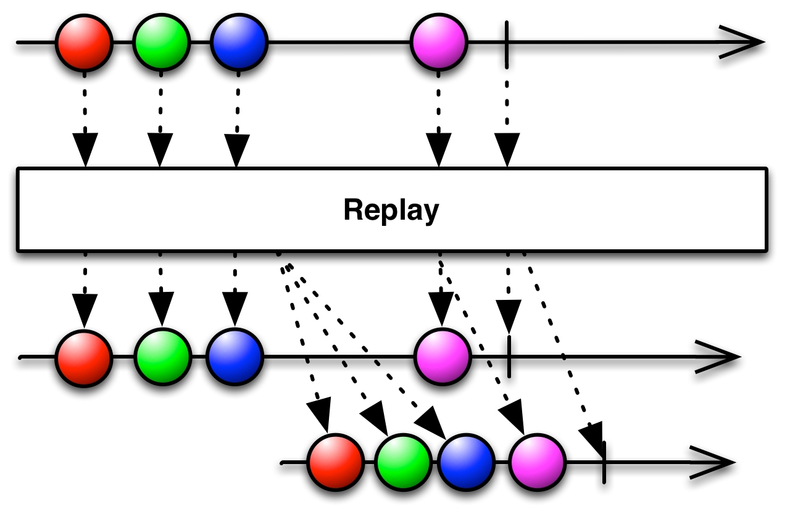
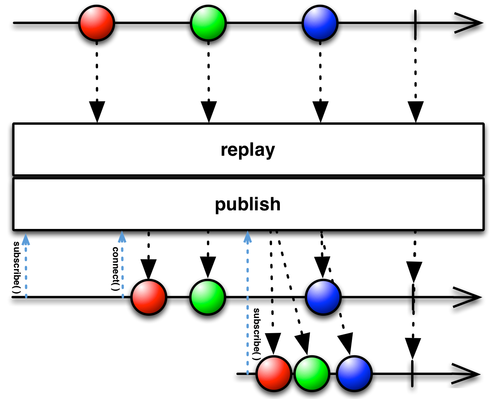
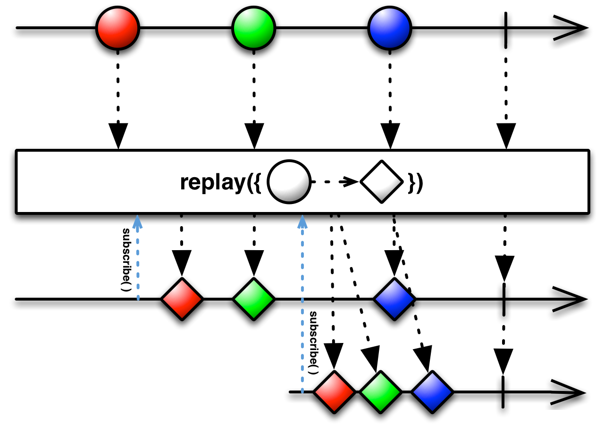

## Replay

保证所有的观察者收到相同的数据序列，即使它们在Observable开始发射数据之后才订阅

可连接的Observable (*connectable Observable*)与普通的Observable差不多，不过它并不会在被订阅时开始发射数据，而是直到使用了`Connect`操作符时才会开始。用这种方法，你可以在任何时候让一个Observable开始发射数据。

如果在将一个Observable转换为可连接的Observable之前对它使用`Replay`操作符，产生 的这个可连接Observable将总是发射完整的数据序列给任何未来的观察者，即使那饿写观察者在这个Observable开始给其它观察者发射数据之后才订阅。

RxJava的实现为`replay`，它有多个接受不同参数的变体，有的可以指定`replay`的最大缓存数量，有的还可以指定调度器。

* Javadoc: [replay()](http://reactivex.io/RxJava/javadoc/rx/Observable.html#replay())
* Javadoc: [replay(int)](http://reactivex.io/RxJava/javadoc/rx/Observable.html#replay(int))
* Javadoc: [replay(long,TimeUnit)](http://reactivex.io/RxJava/javadoc/rx/Observable.html#replay(long,%20java.util.concurrent.TimeUnit))
* Javadoc: [replay(int,long,TimeUnit)](http://reactivex.io/RxJava/javadoc/rx/Observable.html#replay(int,%20long,%20java.util.concurrent.TimeUnit))

有一种 `replay`返回一个普通的Observable。它可以接受一个变换函数为参数，这个函数接受原始Observable发射的数据项为参数，返回结果Observable要发射的一项数据。因此，这个操作符其实是`replay`变换之后的数据项。

* Javadoc: [replay(Func1)](http://reactivex.io/RxJava/javadoc/rx/Observable.html#replay(rx.functions.Func1))
* Javadoc: [replay(Func1,int)](http://reactivex.io/RxJava/javadoc/rx/Observable.html#replay(rx.functions.Func1,%20int))
* Javadoc: [replay(Func1,long,TimeUnit)](http://reactivex.io/RxJava/javadoc/rx/Observable.html#replay(rx.functions.Func1,%20long,%20java.util.concurrent.TimeUnit))
* Javadoc: [replay(Func1,int,long,TimeUnit)](http://reactivex.io/RxJava/javadoc/rx/Observable.html#replay(rx.functions.Func1,%20int,%20long,%20java.util.concurrent.TimeUnit))

