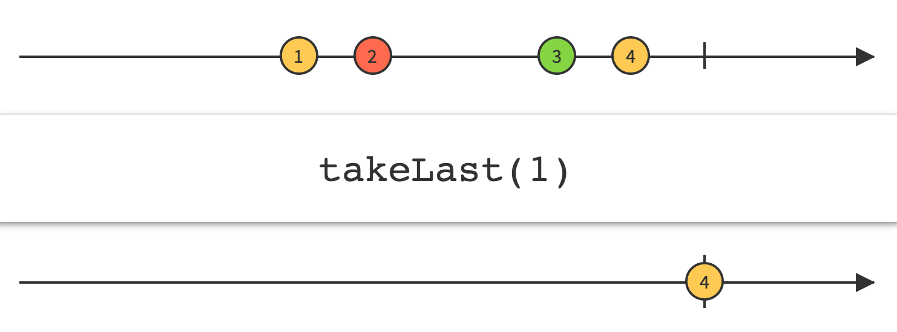
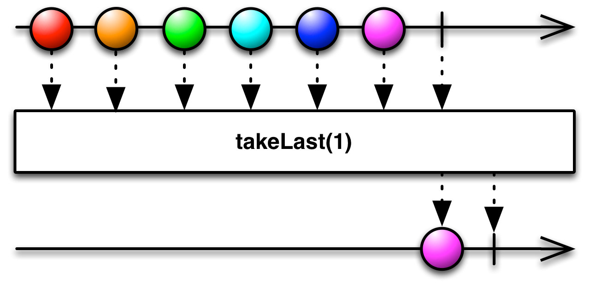
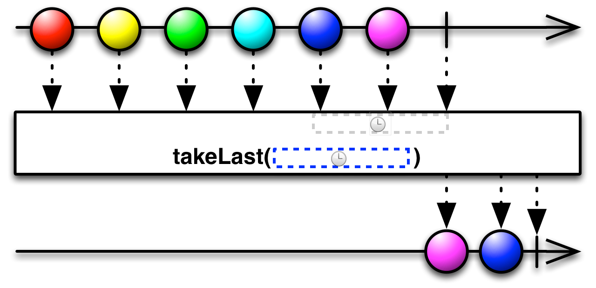
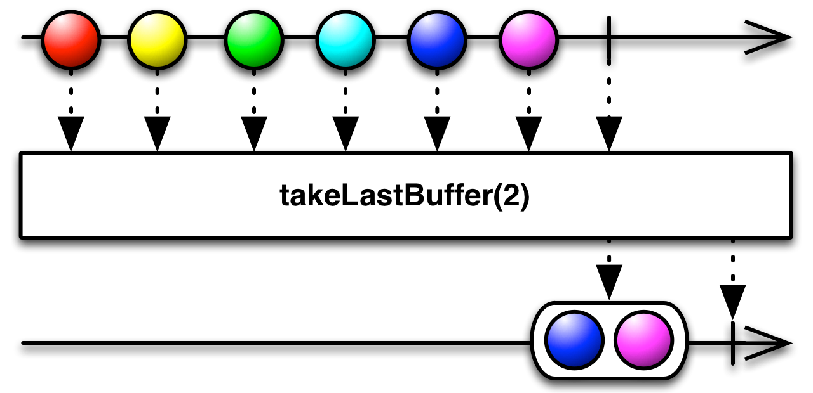

## TakeLast

发送Observable发送的最后N项数据

使用`TakeLast `操作符修改原始Observable，你可以只发送Observable'发送的后N项数据，忽略前面的数据。

### taskLast.n

使用`takeLast `操作符，你可以只发送原始Observable发送的后N项数据，忽略之前的数据。注意：这会延迟原始Observable发送的任何数据项，直到它全部完成。

`takeLast `的这个变体默认不在任何特定的调度器上执行。

* Javadoc: [takeLast(int)](http://reactivex.io/RxJava/javadoc/rx/Observable.html#takeLast(int))

### takeLast.t

还有一个`takeLast `变体接受一个时长而不是数量参数。它会发送在原始Observable的生命周期内最后一段时间内发送的数据。时长和时间单位通过参数指定。

注意：这会延迟原始Observable发送的任何数据项，直到它全部完成。

`takeLast `的这个变体默认在`computation`调度器上执行，但是你可以使用第三个参数指定其它的调度器。

### takeLastBuffer

还有一个操作符叫`takeLastBuffer`，它和`takeLast`类似，，唯一的不同是它把所有的数据项收集到一个`List`再发送，而不是依次发送一个。

* Javadoc: [takeLastBuffer(int)](http://reactivex.io/RxJava/javadoc/rx/Observable.html#takeLastBuffer(int))
* Javadoc: [takeLastBuffer(long,TimeUnit)](http://reactivex.io/RxJava/javadoc/rx/Observable.html#takeLastBuffer(long,%20java.util.concurrent.TimeUnit))
* Javadoc: [takeLastBuffer(long,TimeUnit,Scheduler)](http://reactivex.io/RxJava/javadoc/rx/Observable.html#takeLastBuffer(long,%20java.util.concurrent.TimeUnit,%20rx.Scheduler))
* Javadoc: [takeLastBuffer(int,long,TimeUnit)](http://reactivex.io/RxJava/javadoc/rx/Observable.html#takeLastBuffer(int,%20long,%20java.util.concurrent.TimeUnit))
* Javadoc: [takeLastBuffer(int,long,TimeUnit,Scheduler)](http://reactivex.io/RxJava/javadoc/rx/Observable.html#takeLastBuffer(int,%20long,%20java.util.concurrent.TimeUnit,%20rx.Scheduler))

