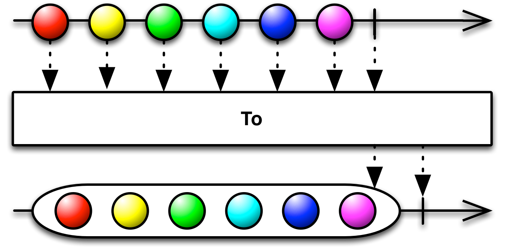
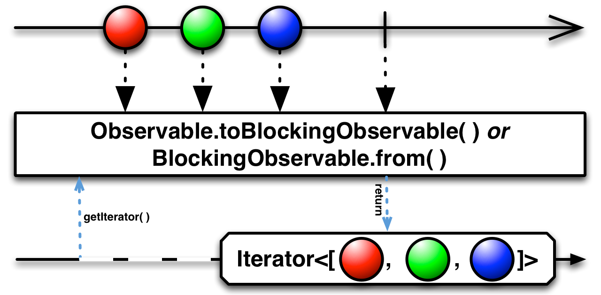
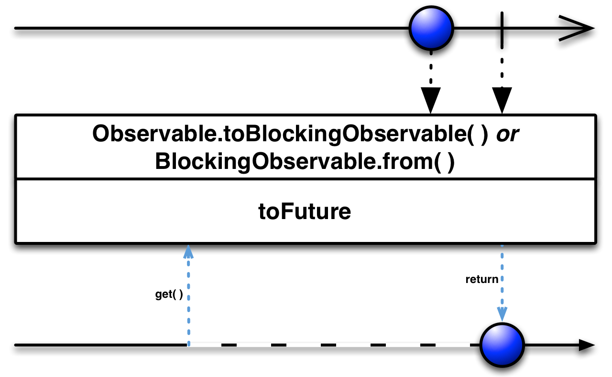
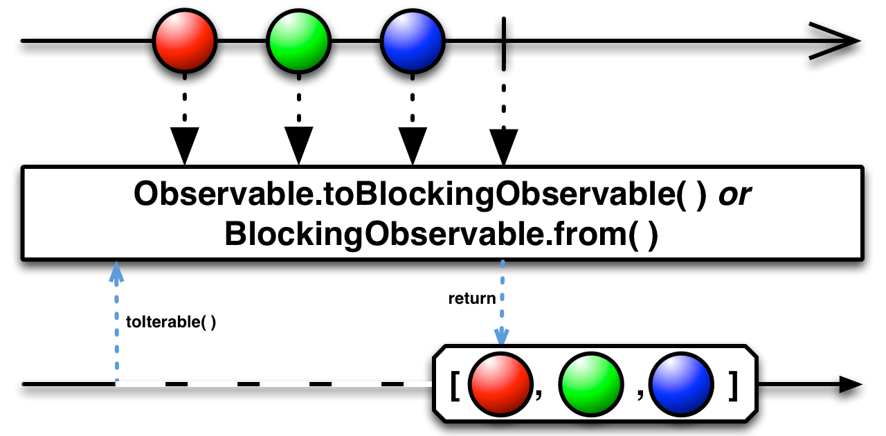
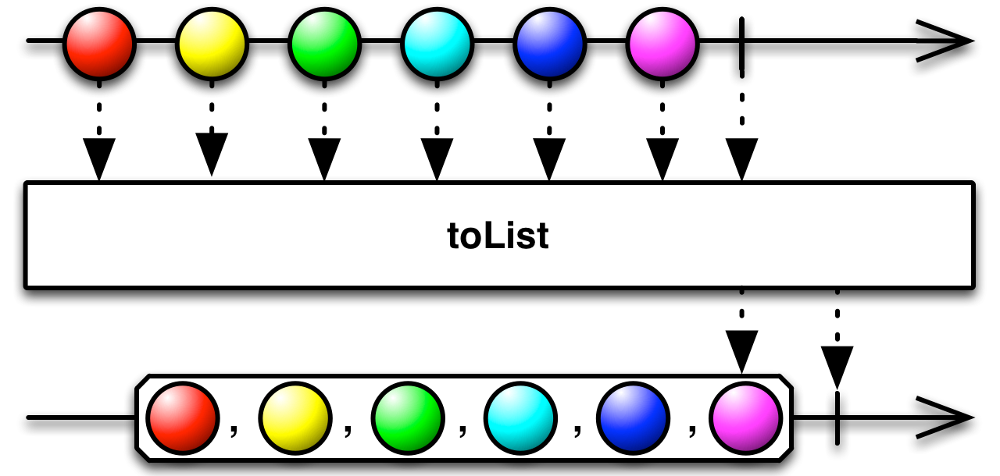
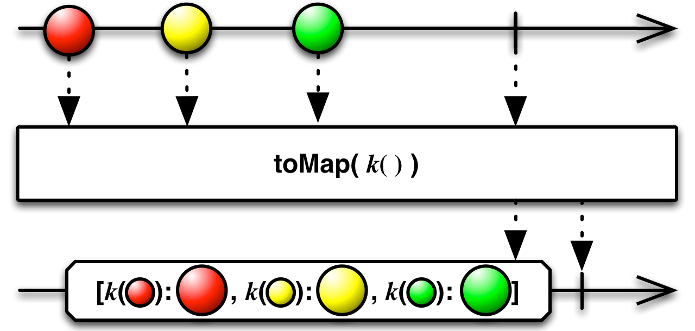
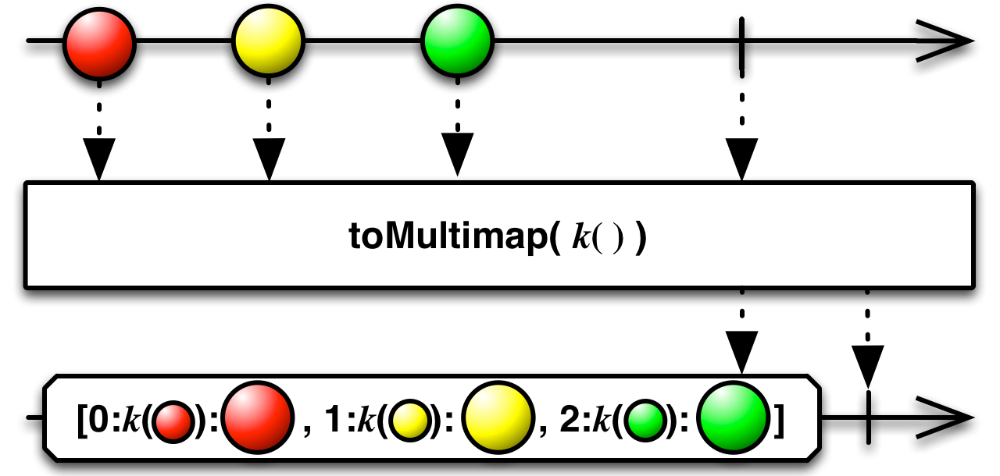
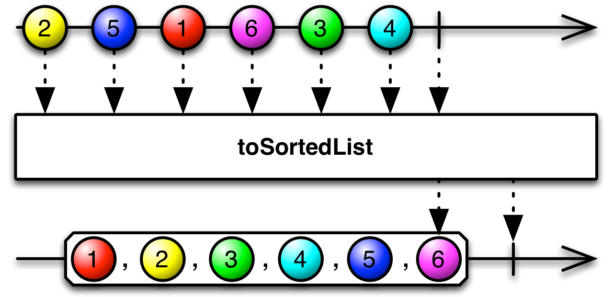
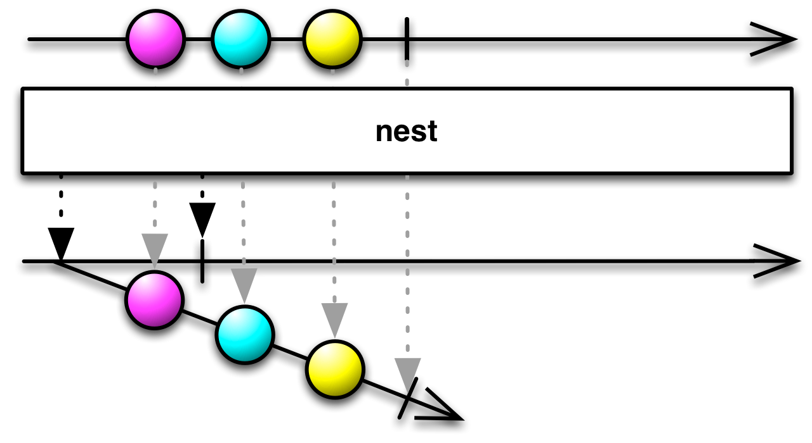

## To

将Observable转换为另一个对象或数据结构

ReactiveX的很多语言特定实现都有一种操作符让你可以将Observable或者Observable发射的数据序列转换为另一个对象或数据结构。它们中的一些会阻塞直到Observable终止，然后生成一个等价的对象或数据结构；另一些返回一个发射那个对象或数据结构的Observable。

在某些ReactiveX实现中，还有一个操作符用于将Observable转换成阻塞式的。一个阻塞式的Ogbservable在普通的Observable的基础上增加了几个方法，用于操作Observable发射的数据项。

### getIterator

`getIterator`操作符只能用于`BlockingObservable`的子类，要使用它，你首先必须把原始的Observable转换为一个`BlockingObservable`。可以使用这两个操作符：`BlockingObservable.from`或`the Observable.toBlocking`。

这个操作符将Observable转换为一个`Iterator`，你可以通过它迭代原始Observable发射的数据集。

* Javadoc: [BlockingObservable.getIterator()](http://reactivex.io/RxJava/javadoc/rx/observables/BlockingObservable.html#getIterator())

### toFuture

`toFuture`操作符也是只能用于`BlockingObservable`。这个操作符将Observable转换为一个返回单个数据项的`Future`，如果原始Observable发射多个数据项，`Future`会收到一个`IllegalArgumentException`；如果原始Observable没有发射任何数据，`Future`会收到一个`NoSuchElementException`。

如果你想将发射多个数据项的Observable转换为`Future`，可以这样用：`myObservable.toList().toBlocking().toFuture()`。

* Javadoc: [BlockingObservable.toFuture()](http://reactivex.io/RxJava/javadoc/rx/observables/BlockingObservable.html#toFuture())

### toIterable

`toFuture`操作符也是只能用于`BlockingObservable`。这个操作符将Observable转换为一个`Iterable`，你可以通过它迭代原始Observable发射的数据集。

* Javadoc: [BlockingObservable.toIterable()](http://reactivex.io/RxJava/javadoc/rx/observables/BlockingObservable.html#toIterable())

### toList

通常，发射多项数据的Observable会为每一项数据调用`onNext`方法。你可以用`toList`操作符改变这个行为，让Observable将多项数据组合成一个`List`，然后调用一次`onNext`方法传递整个列表。

如果原始Observable没有发射任何数据就调用了`onCompleted`，`toList`返回的Observable会在调用`onCompleted`之前发射一个空列表。如果原始Observable调用了`onError`，`toList`返回的Observable会立即调用它的观察者的`onError`方法。

`toList`默认不在任何特定的调度器上执行。

* Javadoc: [toList()](http://reactivex.io/RxJava/javadoc/rx/Observable.html#toList())

### toMap

`toMap`收集原始Observable发射的所有数据项到一个Map（默认是HashMap）然后发射这个Map。你可以提供一个用于生成Map的Key的函数，还可以提供一个函数转换数据项到Map存储的值（默认数据项本身就是值）。

`toMap`默认不在任何特定的调度器上执行。

* Javadoc: [toMap(Func1)](http://reactivex.io/RxJava/javadoc/rx/Observable.html#toMap(rx.functions.Func1))
* Javadoc: [toMap(Func1,Func1)](http://reactivex.io/RxJava/javadoc/rx/Observable.html#toMap(rx.functions.Func1,%20rx.functions.Func1))
* Javadoc: [toMap(Func1,Func1,Func0)](http://reactivex.io/RxJava/javadoc/rx/Observable.html#toMap(rx.functions.Func1,%20rx.functions.Func1,%20rx.functions.Func0))

### toMultiMap

`toMultiMap`类似于`toMap`，不同的是，它生成的这个Map同时还是一个`ArrayList`（默认是这样，你可以传递一个可选的工厂方法修改这个行为）。

`toMultiMap`默认不在任何特定的调度器上执行。

* Javadoc: [toMultiMap(Func1)](http://reactivex.io/RxJava/javadoc/rx/Observable.html#toMultimap(rx.functions.Func1))
* Javadoc: [toMultiMap(Func1,Func1)](http://reactivex.io/RxJava/javadoc/rx/Observable.html#toMultimap(rx.functions.Func1,%20rx.functions.Func1))
* Javadoc: [toMultiMap(Func1,Func1,Func0)](http://reactivex.io/RxJava/javadoc/rx/Observable.html#toMultimap(rx.functions.Func1,%20rx.functions.Func1,%20rx.functions.Func0))
* Javadoc: [toMultiMap(Func1,Func1,Func0,Func1)](http://reactivex.io/RxJava/javadoc/rx/Observable.html#toMultimap(rx.functions.Func1,%20rx.functions.Func1,%20rx.functions.Func0,%20rx.functions.Func1))

### toSortedList

`toSortedList`类似于`toList`，不同的是，它会对产生的列表排序，默认是自然升序，如果发射的数据项没有实现`Comparable`接口，会抛出一个异常。然而，你也可以传递一个函数作为用于比较两个数据项，这是`toSortedList`不会使用`Comparable`接口。

`toSortedList`默认不在任何特定的调度器上执行。

* Javadoc: [toSortedList()](http://reactivex.io/RxJava/javadoc/rx/Observable.html#toSortedList())
* Javadoc: [toSortedList(Func2)](http://reactivex.io/RxJava/javadoc/rx/Observable.html#toSortedList(rx.functions.Func2))

### nest

`nest`操作符有一个特殊的用途：讲一个Observable转换为一个发射这个Observable的Observable。
